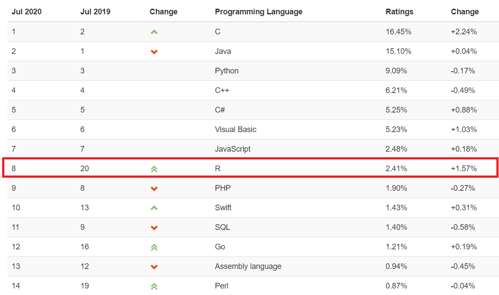
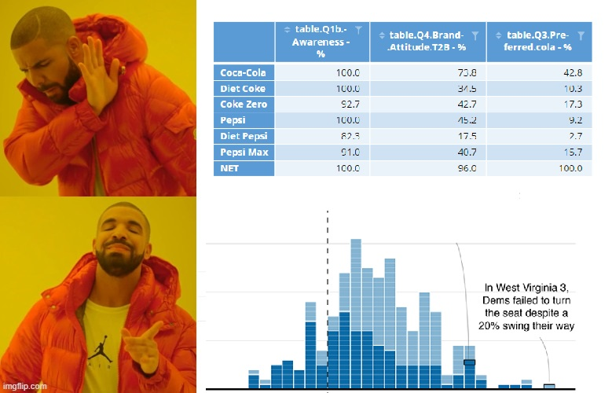
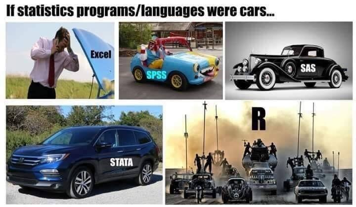
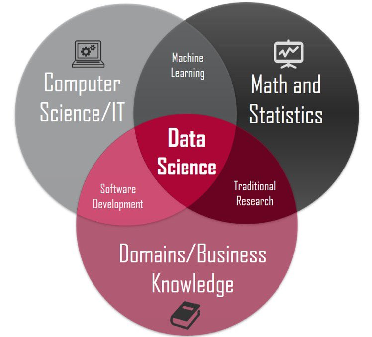

```{r setup, include=FALSE}
options(digits = 3)
knitr::opts_chunk$set(
  comment = "#>",
  echo = TRUE,
  collapse = TRUE,
  message = FALSE,
  warning = FALSE,
  out.width = "50%",
  fig.align = "center",
  fig.asp = 0.618, # 1 / phi
  fig.show = "hold"
)
```

## 本节课的目的


- 明确R能给我们生活带来什么？
  - R是什么?
  - R能干什么?
  - 为什么是R？
  
\vskip 0.5cm

- 十分钟上手R语言
  - 需要一台能联网的电脑
  - 安装R + Rstudio
  - 安装宏包
  
## 统计编程技能，能给我们生活带来什么？ 

- 用在工业生产上：找工作、提升竞争力
- 用在创新创业上：参加竞赛，参与项目
- 用在科学研究上：读研读博（自然科学、社会科学）
- 用在学习方法上：改变传统的统计学习方法

# R是什么

## R那些事

- 1992年，新西兰奥克兰大学统计学教授 Ross Ihaka 和 Robert Gentleman，为了方便地给学生教授统计学课程，他们设计开发了R语言（他们名字的首字母都是R）。

```{r echo=FALSE, out.width = '0.8\\textwidth'}
knitr::include_graphics(path = "images/R_inventor.png")
```


## R是什么

R语言是用于统计分析，图形表示和报告的编程语言:

- R 是一个\textcolor{red}{统计编程}语言（statistical programming）
- R 可运行于多种平台之上，包括Windows、UNIX 和 Mac OS X
- R 拥有顶尖水准的\textcolor{red}{制图}功能
- R 是免费的
- R 应用广泛，拥有丰富的\textcolor{red}{库包}
- 活跃的\textcolor{red}{社区}(\#rstats)


## R 的前世今生

- 2000年，R1.0.0 发布
- 2004年，第一届国际useR!会议（随后每年举办一次）
- 2005年，ggplot2宏包\textcolor{red}{（2018.8 - 2019.8下载量超过 1.3 亿次）}
- 2012年，R2.15.2 发布
- 2013年，R3.0.2 发布, CRAN上的宏包数量5026个
- 2016年，Rstudio公司推出 tidyverse 宏包\textcolor{red}{（数据科学当前最流行的R宏包）}
- 2017年，R3.4.1 发布，CRAN上的宏包数量10875个
- 2019年，R3.6.1 发布，CRAN上的宏包数量15102个
- 2020年，R4.0.0 发布，CRAN上的宏包数量16054个


[The History of R](https://blog.revolutionanalytics.com/2020/07/the-history-of-r-updated-for-2020.html)


## R语言发展趋势

```{r echo=FALSE, out.width = '100%'}

```

[TIOBE index](https://www.tiobe.com/tiobe-index/)


## 安装很方便

官网地址：<https://www.r-project.org/>

```{r echo=FALSE, out.width = '100%'}
knitr::include_graphics("images/Rinstall.png")
```

## IDE很舒服

官网地址：<https://rstudio.com/>

```{r out.width = '80%', echo = FALSE}
knitr::include_graphics("images/rstudio-editor.png")
```

## 两者的关系

```{r out.width = '100%', echo = FALSE}
knitr::include_graphics("images/engine_dashboard.png")
```


## R路上的大神

2019 年 8 月，国际统计学年会将考普斯总统奖（\textcolor{red}{被誉为统计学的诺贝尔奖}）奖颁给 tidyverse 的作者

```{r echo=FALSE, out.width = '50%'}
knitr::include_graphics("images/hadley-wickham.jpg")
```

- [Hadley Wickham](http://hadley.nz/)
- R路上的大神
- 一个改变了R语言的人


# R能干什么


## 数据科学的流程

Hadley Wickham将[数据科学流程](https://r4ds.had.co.nz/)分解成6个环节


```{r echo=FALSE, out.width = '\\textwidth'}
knitr::include_graphics(path = "images/data-science-explore.png")
```


## tidyverse套餐

```{r out.width = '80%', echo = FALSE}
knitr::include_graphics("images/tidyverse.png")
```
\centering{https://www.tidyverse.org/}


## 以最快的速度获得一次成功的经验

```{r out.width = '90%', echo = FALSE}

```


## 难吗？
\Huge
\centering{ 感觉很难吗？ \\ 如果是，那说明你认真听了}


## 看了这些代码，可能第一眼感觉是这样的
```{r echo=FALSE, out.width = '100%', fig.cap='图片来自电影《降临》'}

```


## 但我更希望学完后
```{r echo=FALSE, out.width = '100%', fig.cap='图片来自美剧《权利的游戏》'}
knitr::include_graphics("images/night_king.jpg")
```


# 为什么是R


## 社会科学需要统计

```{r echo=FALSE, out.width = '60%'}
knitr::include_graphics("images/social_science.jpg")
```

\centering{往往用统计的，都不是学统计的}


## 社会科学需要可视化

```{r echo=FALSE, out.width = '100%'}

```


\centering{没有好看的皮囊，没人愿意了解你的灵魂}


## 社会科学需要编程

```{r out.width = '90%', fig.align='center', echo = FALSE}
knitr::include_graphics("images/R_Excel.png", dpi = 150)
```

\centering{现在小学生都开始学编程了}


## 社会科学需要可重复性

```{r echo=FALSE, out.width = '100%'}

```

\centering{
论文，要公布原始数据和分析代码}


## R语言之美，你值得拥有


| 序号 	| 内容          	| 特性     	| 评价 	| 
|------	|---------------	|----------	|------	|
| 1    	| 统计分析      	| 看家本领 	| 好用 	|
| 2    	| ggplot2画图   	| 颜值担当 	| 好看 	| 
| 3    	| tidyverse语法 	| 人类语言 	| 好学 	| 
| 4    	| 可重复性报告  	| 方便快捷 	| 好玩 	| 


## 当今最值得学习的数据科学语言

```{r echo=FALSE, out.width = '100%'}
knitr::include_graphics("images/why_R_is_best_language.png")
```

\tiny
https://www.r-bloggers.com/2017/01/why-r-is-the-best-data-science-language-to-learn-today/


## 当今最值得学习的数据科学语言

```{r echo=FALSE, out.width = '100%'}

```


## 一见钟情，还是相见恨晚？

```{r echo=FALSE, out.width = '100%'}

```


# 关于学习

## 我们的课程不会枯燥

```{r echo=FALSE, out.width = '45%'}

```

- 数据科学是为社会科学服务的，我们会有很多案例
- 编程是工具，统计是灵魂，专业是核心


## 关于学习

我很少使用

$$
f(x)=\frac{1}{\sqrt{2 \pi}} e^{-\frac{1}{2} x^{2}}
$$

更多的是

```{r, eval = FALSE}
library(tidyverse)
summary_monthly_temp <- weather %>%
  group_by(month) %>%
  summarize(
    mean = mean(temp),
    std_dev = sd(temp)
  )
```

## 关于学习

### 课程目标

-   训练数据思维，提升编程技能，培养创新能力

### 学习方法

-   **问题驱动型学习**
-   多实践（光看李小龙的电影，是学不会功夫的）
-   把R看做是知识学习的**脚手架**，不是 learning R，而是 learning with R.

### 课件内容

- [https://github.com/perlatex/linguists-stats-2022](https://github.com/perlatex/linguists-stats-2022)


## 关于学习

### 授课方式

-  边写代码边讲
-  大家同步练习，运行结果截图到QQ群

### QQ交流群

```{r echo=FALSE, out.width = '30%'}
knitr::include_graphics("images/QQgroup.png")
```


## 推荐参考书

- 教程
  - [https://bookdown.org/wangminjie/R4DS/](https://bookdown.org/wangminjie/R4DS/)

- 推荐参考书
  - [R for Data Science](https://r4ds.had.co.nz/)
  - [Statistics for Linguists: An Introduction Using R](https://osf.io/34mq9/)
  - [r-for-linguists](http://eleanorchodroff.com/r-for-linguists/index.html)
  - [Regression Modeling for Linguistic Data](https://github.com/msonderegger/rmld-v1.0)


## 让R语言成为最有收获感的一门课
```{r echo=FALSE, out.width = '100%'}

```