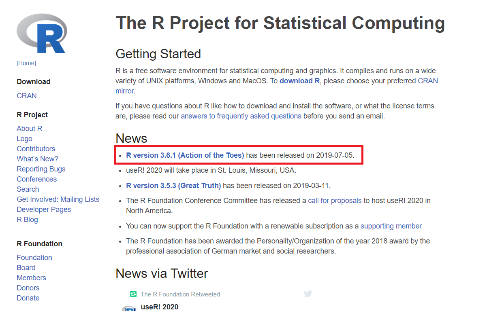
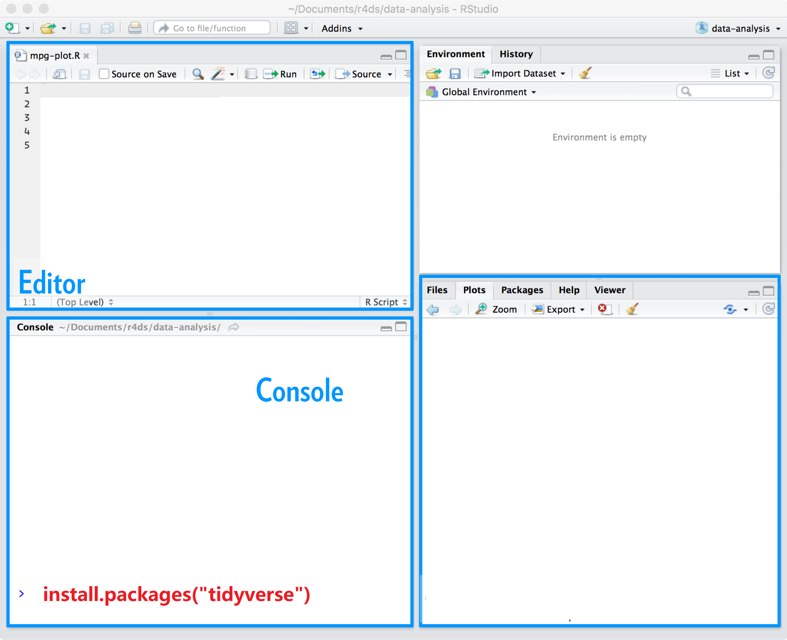
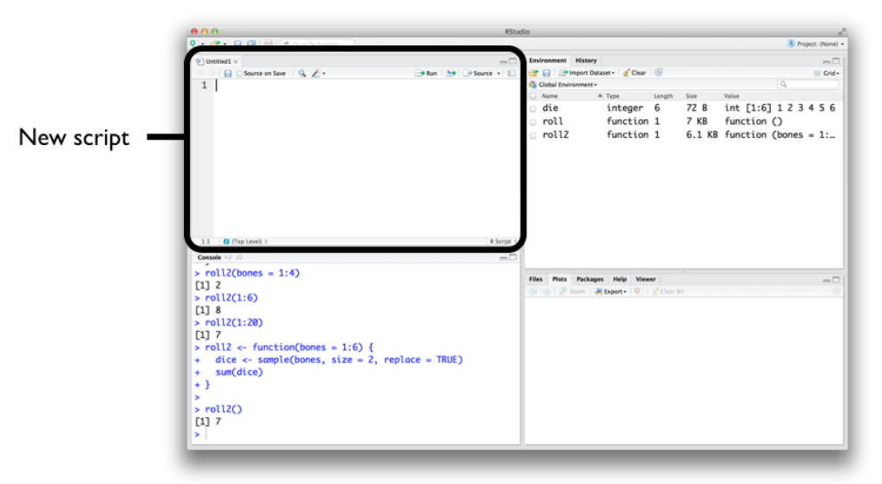

```{r setup, include=FALSE}
options(digits = 3)
knitr::opts_chunk$set(
  comment = "#>",
  echo = TRUE,
  collapse = TRUE,
  message = FALSE,
  warning = FALSE,
  out.width = "50%",
  fig.align = "center",
  fig.asp = 0.618, # 1 / phi
  fig.show = "hold"
)
```

# 配置R语言环境

## 环境配置

主要分三步：

-   安装R
-   安装Rstudio
-   安装必要的宏包

## 第一步安装R

-   下载并安装R，官方网站<http://cran.r-project.org>

```{r echo=FALSE, out.width = '85%'}

```

## 第二步安装RStudio

-   下载并安装RStudio，官方网站 <https://www.rstudio.com/download>
-   选择`RStudio Desktop`

```{r out.width = '85%', echo = FALSE}

```

## 注意事项

这里有个小小的提示：

-   电脑用户名\textcolor{red}{不要}有\textcolor{red}{中文}和\textcolor{red}{空格}

-   尽量安装在非系统盘，比如，可以选择安装在D盘

-   安装路径\textcolor{red}{不要}有\textcolor{red}{中文}和\textcolor{red}{空格}。比如，这样就比较好

    -   `D:/R`
    -   `D:/Rstudio`


\small
可观看视频[https://www.bilibili.com/video/BV1hA411e7k3](https://www.bilibili.com/video/BV1hA411e7k3)后安装


## RStudio很友好

```{r out.width = '85%', echo = FALSE}
knitr::include_graphics("images/rstudio-editor1.png")
```


## RStudio很友好

- 左上角是`Editor`窗口，负责编写代码
- 左下角是`Console`窗口，可以键入命令
- 右上角是`Environment`和`History`窗口，保存当前存储的数据和历史命令记录等
- 右下角是`Plot`和`Help`窗口，用于显示绘制图片和帮助文档


## R 与 RStudio 是什么关系呢

\qquad \qquad \qquad R \hspace{4cm} RStudio

```{r out.width = '45%', echo = FALSE}
knitr::include_graphics(c("images/engine.jpg", "images/dashboard.jpg"))
```

<!-- ## 使用 -->

<!--  **Not this**: \hspace{2cm} **Open this**:  -->

<!-- ```{r out.width = '45%', echo = FALSE, fig.align = "left"} -->
<!-- knitr::include_graphics(c("images/Rlogo.png", "images/rstudio_ball.png")) -->
<!-- ``` -->


## 必要的配置(可选)

- 宏包安装设置成国内镜像 `Tools > Global options`

```{r out.width = '45%', echo = FALSE}

knitr::include_graphics("images/mirror2.png")
```


## 必要的配置(可选)
- 如果打开代码是乱码，试试修设置 `Tools > Global options`

```{r, out.width = '75%', echo = FALSE}
knitr::include_graphics("images/code_utf_8.png")
```


## 必要的配置

- 如果每次打开Rstudio非常慢，可以将这几个选项取消掉`Tools > Global options`

```{r, out.width = '75%', echo = FALSE}
knitr::include_graphics("images/dont-load-data.png")
```


## 第三步安装宏包

```{r out.width = '65%', echo = FALSE}

```

-  命令行安装

   - `install.packages("tidyverse")`


## 使用宏包

```{r out.width = '100%', echo = FALSE}

```

# 测试

## 测试

```{r out.width = '65%', echo = FALSE}

```

在Console内键入 `1 + 1` 并按回车后，将显示如下结果
```{r}
1 + 1
```


## 脚本

通过Rstudio菜单栏依此点击`File > New File > R Script` 来创建一个新的脚本。**脚本**文件通常以`.R`作为文件的后缀名。

```{r intro-R-39, out.width = '75%', echo = FALSE}

```


## 脚本

如何运行脚本呢？方法有很多

  
```{r intro-R-40, out.width = '75%', echo = FALSE}

```

- 按住 `Ctrl` 键，然后按回车键`Enter`，可以运行**光标所在行**的代码
- 点击 `Run`, 运行**光标所在行**的代码
- 点击 `Source`，从头到尾运行当前脚本**全部**代码
- 鼠标选中多行代码，然后点击 `Run`或者`Ctrl + Enter`


## 测试

复制以下代码到脚本编辑区 \small

```{r, eval=FALSE}
library(ggplot2)

ggplot(midwest, aes(x = area, y = poptotal)) +
  geom_point(aes(color = state, size = popdensity)) +
  geom_smooth(method = "loess", se = F) +
  xlim(c(0, 0.1)) +
  ylim(c(0, 500000)) +
  labs(
    title = "Scatterplot",
    subtitle = "Area Vs Population",
    x = "Area",
    y = "Population"
  )
```


## 测试

```{r out.width = '100%', echo = FALSE}
library(ggplot2)

ggplot(midwest, aes(x = area, y = poptotal)) +
  geom_point(aes(color = state, size = popdensity)) +
  geom_smooth(method = "loess", se = F) +
  xlim(c(0, 0.1)) +
  ylim(c(0, 500000)) +
  labs(
    title = "Scatterplot",
    subtitle = "Area Vs Population",
    x = "Area",
    y = "Population"
  )
```

# 可能的问题

## 可能的问题

-   我的电脑是苹果系统，怎么安装呢？

-   我的Rstudio需要哪些设置？

-   为什么Rstudio打开是空白呢？

-   安装宏包太慢，怎么解决？

-   安装宏包，遇到报错信息"unable to access index for repository..."？


# 如何使用Rstudio Cloud

## 可能

学习R语言，首先需要配置运行环境，但可能遇到

- 安装R和Rstudio路径不规范，
- 也有可能电脑的版本老旧，
- 还有就是有些同学的电脑开机用户名是中文，导致在Rmarkdown里运行结果不能正常显示。

这些不顺畅的因素都会带来挫败感，从而影响入门学习的心情。


本文介绍\color{red}{免安装}的方法！


## 云平台 

浏览器打开 https://rstudio.cloud/

```{r, out.width = '100%', echo = FALSE}

```

  
## 注册 

注册一个账号

```{r, out.width = '100%', echo = FALSE}

```

  
## 填入信息 

```{r, out.width = '100%', echo = FALSE}

```


## 登录后创建Project

```{r, out.width = '100%', echo = FALSE}

```

## 导入课件

```{r, out.width = '100%', echo = FALSE}

```
\small
复制 https://github.com/perlatex/linguists-stats-2022 


## 开始界面

```{r, out.width = '100%', echo = FALSE}

```


## 安装宏包

```{r, out.width = '100%', echo = FALSE}

```


## 安装宏包

```{r, out.width = '100%', echo = FALSE}

```

## 打开学习课件

```{r, out.width = '100%', echo = FALSE}

```

以上步骤成功后，每次都是从这里开始喔！

## 愉快的玩耍

```{r, out.width = '100%', echo = FALSE}

```


## 每段代码都成功后，整体可以生成一份文档

```{r, out.width = '100%', echo = FALSE}

```


## 她的样子

```{r, out.width = '100%', echo = FALSE}

```


## 她在代码的身边

```{r, out.width = '100%', echo = FALSE}

```

## 导出到本地

```{r, out.width = '100%', echo = FALSE}

```

# 创建自己的工作空间

## 创建自己的项目

```{r, out.width = '100%', echo = FALSE}

```


## 项目名称

```{r, out.width = '100%', echo = FALSE}

```

## 本地文件上传到云端

```{r, out.width = '100%', echo = FALSE}

```


## 上传文件夹

```{r, out.width = '100%', echo = FALSE}

```


## 愉快地玩耍

```{r, out.width = '100%', echo = FALSE}

```


##
\Huge
\centering{
Welcome to R, RStudio, and the tidyverse!
}
