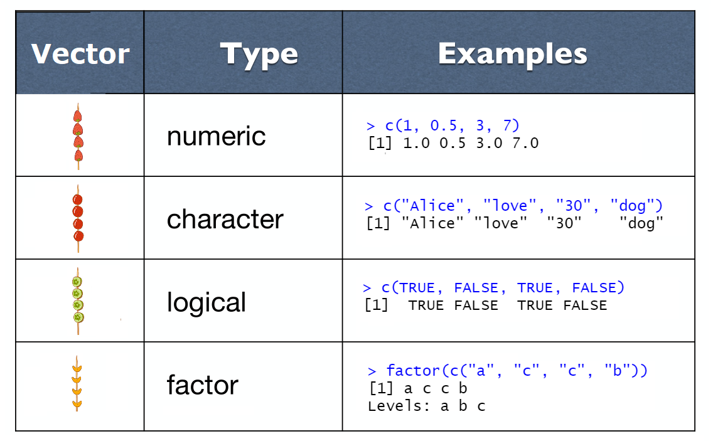
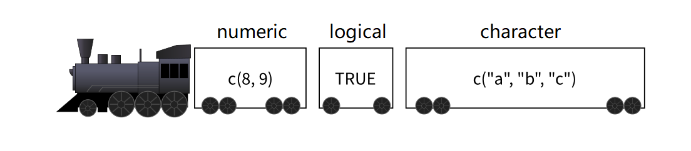
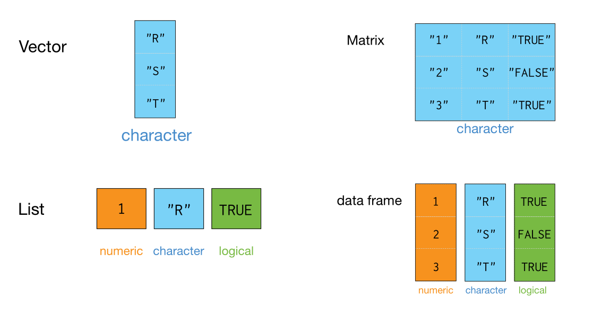

```{r setup, include=FALSE}
options(digits = 3)
knitr::opts_chunk$set(
  comment = "#>",
  echo = TRUE,
  collapse = TRUE,
  message = FALSE,
  warning = FALSE,
  out.width = "50%",
  fig.align = "center",
  fig.asp = 0.618, # 1 / phi
  fig.show = "hold"
)
```


## 本节课的内容

- 对象
- 向量
- 数据结构
- 运算符及向量运算
- 函数
- 子集选取
  
  
# 对象
## 对象

R语言里**一切都是对象（object）**。

```{r, out.width = "65%", echo=FALSE}
knitr::include_graphics("images/objects_box.png")
```

\centering{可以装数据、装函数}

## 对象的创建
**对象的创建与使用**。首先确定一个对象名，然后使用赋值操作符 `<-`，将数据赋值给它。

```{r, out.width = "85%", echo=FALSE}
knitr::include_graphics("images/rsyntax1.png")
```

## 赋值符号

在Rstudio中同时按下 `Alt` 和 `-`，就可以产生赋值箭头

```{r, out.width = "99%", echo=FALSE}
knitr::include_graphics("images/keyboard_assignment.png")
```

## 对象的创建与使用

我们给这个盒子取名 x，然后把10这个数放入**盒子**。
```{r assignment operator}
x <- 10
```

当键入 `x` 然后回车，就打印出 `x` 的值。
```{r print x}
x
```


## 对象重新赋值

当我们再把6这个数放入盒子`x`后
```{r}
x <- 6
```


此时`x`就被更新了，变成了最新的数值
```{r}
x
```


## 变量命名规则

- 变量名必须以字母、数字、下划线`_`和句点`.`组成
- 开头不能是数字
- 大小写敏感，`y`和`Y`是两个不同的变量名
- 不能有空格，可以用下划线代替空格，比如

```{r, eval=FALSE}
my_age <- 30
```

## 变量名的可读性

测量男生的身高

- 一般的变量名
```{r, eval=FALSE}
x <- 175
```

- 不错变量名
```{r, eval=FALSE}
height <- 175
```

- 更佳的变量名
```{r, eval=FALSE}
boy_height_cm <- 175
```


## 对象属性

```{r}
x <- 6
```

所有R对象都有其属性，最重要的两个属性：

- 类型
- 长度

```{r}
typeof(x) 
length(x)
```


# 向量

## 盒子可以装更多数据

前面，我们把6这个数放入盒子 `x`，

```{r}
x <- 6
```

现在，我们想多装一些数据（有顺序、好取出），比如`3,4,5,6,7`

```{r, eval=FALSE}
x <- 3, 4, 5, 6, 7   # 这样可以吗？
```


## 冰糖葫芦

我们小时候吃的冰糖葫芦，中间用一根木棒把水果串起来，有先后顺序，而且方便取出。

```{r, out.width = "50%", echo=FALSE}
knitr::include_graphics("images/vector_like11.jpg", dpi = 300)
```


## 向量就像冰糖葫芦

对应到R语言里，用 `c()` 函数实现类似**结构**


```{r, out.width = "80%", echo=FALSE}
knitr::include_graphics("images/vector_like.jpg", dpi = 300)
```


```{r}
x <- c(3, 4, 5, 6, 7)
x
```


## 向量就像冰糖葫芦

```{r, eval=FALSE}
x <- c(3, 4, 5, 6, 7)
```

我们观察到`c()`函数构造**向量**的几个要求

- 这里的`c`就是 combine 或 concatenate 的意思
- 它要求元素之间用**英文的逗号**分隔
- 且元素的数据类型是统一的，比如这里都是数值


## 聚合成新向量

`c()` 函数还可以把两个向量聚合成一个新的向量。
```{r}
low      <- c(1, 2, 3)
high     <- c(4, 5, 6)
sequence <- c(low, high)
sequence
```


## 命名向量(named vector)

向量元素可以有自己的名字
```{r}
x <- c('a' = 5, 'b' = 6, 'c' = 7, 'd' = 8)
x
```

或者
```{r}
x <- c(5, 6, 7, 8)
names(x) <- c('a', 'b', 'c', 'd')
x
```


## 单个值的向量，就可以偷懒

我们再回头看看之前的

```{r, eval=FALSE}
x <- 6
```

它实际上就是
```{r}
x <- c(6)
```

即长度为 1 的向量，相当于，只有一个草莓的糖葫芦。在我看来，`x <- 6` 是 `x <- c(6)` 偷懒的写法。


## 向量的属性

我们再来看看向量的两个基本属性
```{r}
x <- c(3, 4, 5, 6, 7)
```

- 类型
```{r}
typeof(x)
```

- 长度
```{r}
length(x)
```


## 数值型向量

向量的元素都是数值类型，因此也叫数值型向量。

数值型的向量，有 integer 和 double 两种：

```{r}
x <- c(1L, 5L, 2L, 3L)    # 整数型 
x <- c(1.5, -0.5, 2, 3)   # 双精度类型，常用写法
x <- c(3e+06, 1.23e2)     # 双精度类型，科学计数法
```


## 数值型向量，偷懒方法1

但如果向量元素很多，用手工一个个去输入，实际运用中不现实。在特定情况下，有几种偷懒方法:


- `seq()` 函数可以生成等差数列，`from` 参数指定数列的起始值，`to` 参数指定数列的终止值，`by` 参数指定数值的间距：

```{r}
s1 <- seq(from = 0, to = 10, by = 0.5)
s1
```

## 数值型向量，偷懒方法2

- `rep()` 是 repeat（重复）的意思，可以用于产生重复出现的数字序列：

   - `times` 指定要生成的个数
   - `each`  指定每个元素重复的次数

```{r}
s2 <- rep(x = c(0, 1), times = 3)
s2

s3 <- rep(x = c(0, 1), each = 3)
s3
```


## 数值型向量，偷懒方法3

- `m:n`，如果单纯是要生成数值间距为1的数列，用 `m:n` 更快捷，它产生从 m 到 n 的间距为1的数列

```{r}
# Colon operator (with by = 1):
s4 <- 0:10
s4
```


```{r}
s5 <- 10:1
s5
```


## 字符串型向量

字符串（String）数据类型，实际上就是文本类型，必须用**单引号或者是双引号**包含


```{r}
x <- c("a", "b", "c")    
x <- c('Alice', 'Bob', 'Charlie', 'Dave')    
x <- c("hello", "baby", "I love you!") 
```

需要注意的是，`x1`是字符串型向量，`x2`是数值型向量
```{r}
x1 <- c("1", "2", "3")
x2 <- c(1, 2, 3)
```


## 逻辑型向量

逻辑型常称为布尔型（Boolean）：

- 常量值只有 TRUE 和 FALSE。
- TRUE 和 FALSE 在R语言中是保留词汇


```{r}
x <- c(TRUE, TRUE, FALSE, FALSE)
x <- c(T, T, F, F)      # 与上等价，但不推荐
```

以下两者不要混淆

```{r}
x <- c(TRUE, FALSE)             # 逻辑型
x <- c("TRUE", "FALSE")         # 字符串型
```


## 因子型向量

\small
因子型可以看作是字符串向量的增强版，它是带有层级（Levels）信息的字符串向量。

比如，这里四个季节的名称，他们构成一个向量。

```{r}
four_seasons <- c("spring", "summer", 
                  "autumn", "winter")
```


我们使用 `factor()` 函数将其转换成因子型向量

```{r}
four_seasons_factor <- factor(four_seasons)
four_seasons_factor
```


## 因子型向量

\footnotesize
查看因子型向量的时候，同时也显示层级信息

- 默认的情况，它是按照字符串首字母的顺序排序

```{r}
four_seasons_factor <- factor(four_seasons)
four_seasons_factor
```

- 也可以指定顺序，比如按照我对四个季节的喜欢**排序**
```{r}
four_seasons_factor <- factor(
  four_seasons,
  levels = c("summer", "winter", "spring", "autumn")
)
four_seasons_factor
```


## 小结

```{r, out.width = '100%', echo = FALSE}

```


# 数据结构

## 向量

向量，是R语言最基础的数据结构。

```{r, out.width = '70%', echo = FALSE}
knitr::include_graphics("images/vector_like2.jpg", dpi = 300)
```


## 更多的数据结构

前面介绍了向量，它是R语言中最基础的数据结构，我们还会遇到其它数据结构

- 矩阵
- 列表
- 数据框

这些数据结构都可以看作由**向量**衍生出来的。


## 矩阵

矩阵可以存储行(row)和列(column)二维的数据

```{r, out.width = '70%', echo = FALSE}
knitr::include_graphics("images/matrix.jpg", dpi = 300)
```

它实际上是向量的另一种表现形式。


## 矩阵

矩阵可以用 `matrix()` 函数创建，第一位参数的位置是用于创建矩阵的**向量**。比如下面把向量`c(2, 4, 3, 1, 5, 7)` 转换成2行3列的矩阵

```{r intro-R-28, echo=TRUE, message=TRUE, warning=TRUE}
m <- matrix(
  c(2, 4, 3, 1, 5, 7),
  nrow = 2, 
  ncol = 3
)
m
```


## 矩阵

```{r, out.width = '100%', echo = FALSE}
knitr::include_graphics("images/create_matrix.jpg", dpi = 300)
```


## 矩阵的属性

- 类型

```{r}
class(m)
```


- 长度

```{r}
length(m)
```


- 维度
```{r}
dim(m)
```


## 矩阵

- 向量是一个竖着的糖葫芦，在转换成矩阵的时候，也是先竖着排，第一列竖着的方向排满后，就排第二列，这是默认的情形。

- 如果想改变这一传统习惯，也可以增加一个语句 `byrow = TRUE`，这条语句让向量先横着排，排完第一行，再排第二行。

```{r}
matrix(
  c(2, 4, 3, 1, 5, 7), nrow = 2, byrow = TRUE
)
```


## 列表

想象有一个小火车，小火车的每节车厢是独立的，因此每节车厢装的东西可以不一样。这种结构，装载数据的能力很强大，称之为**列表**（list）。

```{r, out.width = '100%', echo = FALSE}

```


## 创建列表

```{r intro-R-31, echo=TRUE, message=TRUE, warning=TRUE}
list1 <- list(
  a = c(5, 10),
  b = c("I", "love", "R", "language", "!"),
  c = c(TRUE, TRUE, FALSE, TRUE)
)
list1
```


## 创建列表

```{r, out.width = '100%', echo = FALSE}
knitr::include_graphics("images/create_list.jpg", dpi = 300)
```


## 列表

 `c()` 函数创建向量 Vs. `list()` 函数创建列表

<!-- - **相同点**：元素之间用逗号分开。 -->
<!-- - **不同点**： -->
<!--   - 向量的元素是单个值；列表的元素可以是更复杂的结构，可以是向量、矩阵或者列表。 -->
<!--   - 向量要求每个元素的数据类型必须相同，要么都是数值型，要么都是字符型；而列表的元素允许不同的数据类型。 -->


```{r, out.width = '100%', echo = FALSE}
knitr::include_graphics("images/c_vs_list.png", dpi = 300)
```


## 列表的属性

- 类型

```{r}
class(list1)
```


- 长度
```{r}
length(list1)
```


## 数据框

列表是一个小火车，如果每节车厢装的**都是向量而且等长**，那么这种特殊形式的列表就变成了**数据框** (data frame)

```{r, out.width = '85%', echo = FALSE}
knitr::include_graphics("images/dataframe.jpg", dpi = 300)
```

\centering{
换句话说，\textcolor{red}{数据框是一种特殊的列表}
}


## 创建数据框

我们可以使用 `data.frame()` 函数构建

```{r intro-R-32, echo=TRUE, message=TRUE, warning=TRUE}
df <- data.frame(
  name      = c("Alice", "Bob", "Carl", "Dave"),
  age       = c(23, 34, 23, 25),
  marriage  = c(TRUE, FALSE, TRUE, FALSE),
  color     = c("red", "blue", "orange", "purple")
)
df
```


## 数据框就是我们经常用的excel表格

```{r, out.width = '100%', echo = FALSE}
knitr::include_graphics("images/create_dataframe.png", dpi = 300)
```

由于数据框融合了向量、列表和矩阵的特性，所以在数据科学的统计建模和可视化中运用非常广泛。


## 数据框的属性

- 类型

```{r}
class(df) 
```


- 维度
```{r}
nrow(df)
ncol(df)
```

## 数据结构

R 对象的数据结构(向量、矩阵、列表和数据框)，总结如下

```{r, out.width = '90%', echo = FALSE}

```

