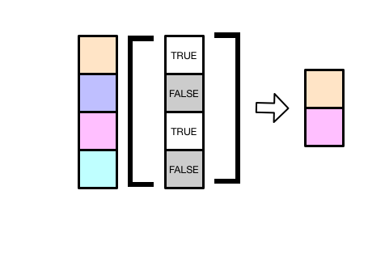

子集选取单独作一章，说明它确实很重要。


## 向量

对于原子型向量(vector)，我们有至少四种方法取子集
```{r}
x <- c(1.1, 2.2, 3.3, 4.4, 5.5)
```


- 正整数： 指定向量元素中的位置
```{r}
x[1]
```

```{r}
x[c(3, 1)]
```

- 负整数：删除指定位置的元素
```{r}
x[-2]
```

- 逻辑向量：将`TRUE`对应位置的元素提取出来

```{r, out.width = '80%', echo = FALSE}

```


```{r}
x[c(TRUE, FALSE, TRUE, FALSE, TRUE)]
```

```{r}
x[x > 4]    # 选取向量中大于4的元素
```

- 如果是命名向量
```{r}
y <- c("a" = 11, "b" = 12, "c" = 13, "d" = 14)
y
```

我们可以用名字向量，返回对应位置的向量
```{r}
y[c("d", "c", "a")]
```

## 列表

对列表取子集，和向量的方法一样。 向量的子集仍然是向量，使用`[`提取列表的子集，总是返回列表。
```{r}
l <- list(
  "one"   = c("a", "b", "c"),
  "two"   = c(1:5),
  "three" = c(TRUE, FALSE)
)
l
```

使用位置索引
```{r}
l[1]
```

也可以使用元素名
```{r}
l["one"]
```

如果想列表元素的值，需要使用`[[`
```{r}
l[[1]]
```

也可以使用其中的元素名，
```{r}
l[["one"]]
```

取出`one`位置上的元素，需要写`[["one"]]`，程序员觉得太麻烦了，所以用`$`来简写
```{r}
l$one
```

所以请记住
- `[` 和`[[`的区别
-`x$y` 是 `x[["y"]]`的简写
 
 
## 矩阵

```{r}
a <- matrix(1:9, nrow = 3)
a
```

我们取第1到2行的2-3列，`[1:2, 2:3]`，中间以逗号分隔，于是得到一个新的矩阵
```{r}
a[1:2, 2:3]
```


有些时候，我们想保留所有的行或者列，比如这里我们选取1到2行的**所有列**，可以这样简写

```{r}
a[1:2, ]
```

想想，会输出什么
```{r}
a[ , ]
```

可以再简化点？
```{r}
a[]
```


是不是可以再简化点？
```{r}
a
```

## 数据框

数据框具有list和matrix的属性，因此

- 当选取数据框的某几列的时候，可以和list一样，指定元素位置，比如`df[1:2]`选取前两列 
- 也可以像矩阵一样，使用行和列的标识选取，比如`df[1:3, ]`选取前三行的所有列

```{r}
df <- data.frame(
  x = 1:4,
  y = 4:1,
  z = c("a", "b", "c", "d")
)
df
```

### Like a list
```{r}
df[1:2]
```

```{r}
df[c("x", "z")]
```

```{r}
df[["x"]]
```

```{r}
df$x
```

### Like a matrix
```{r}
df[, c("x", "z")]
```


```{r}
df[1:3, ]
```


## 习题

- 对数据框，思考`df["x"]`， `df[["x"]]`， `df$x`三者的区别?
- 找出向量`a`中的偶数
```{r}
a <- 1:10
a
```

