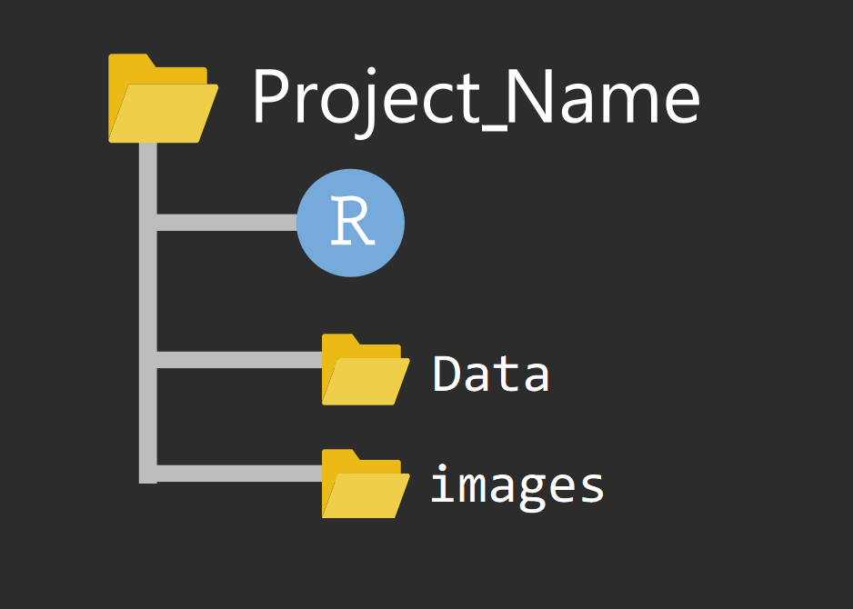
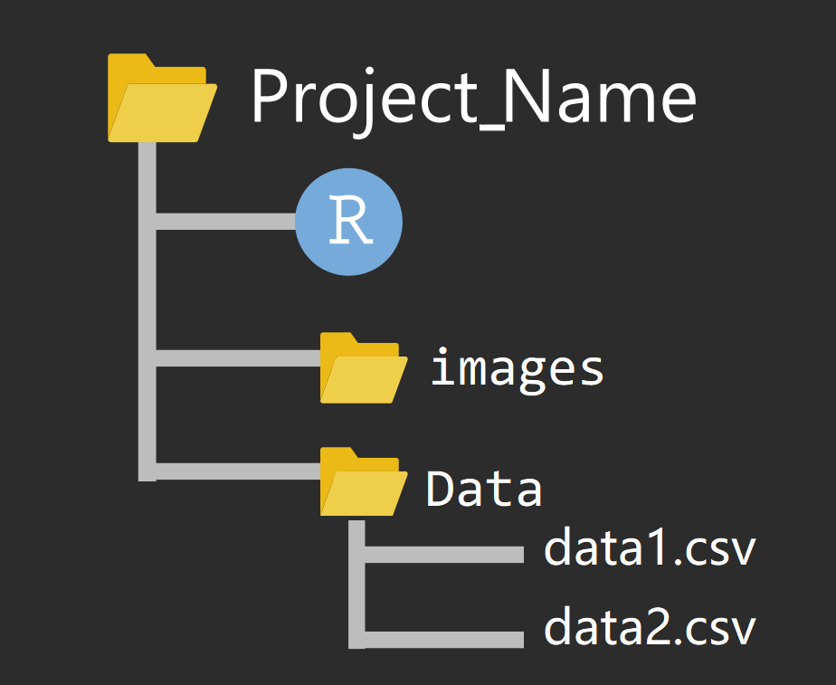
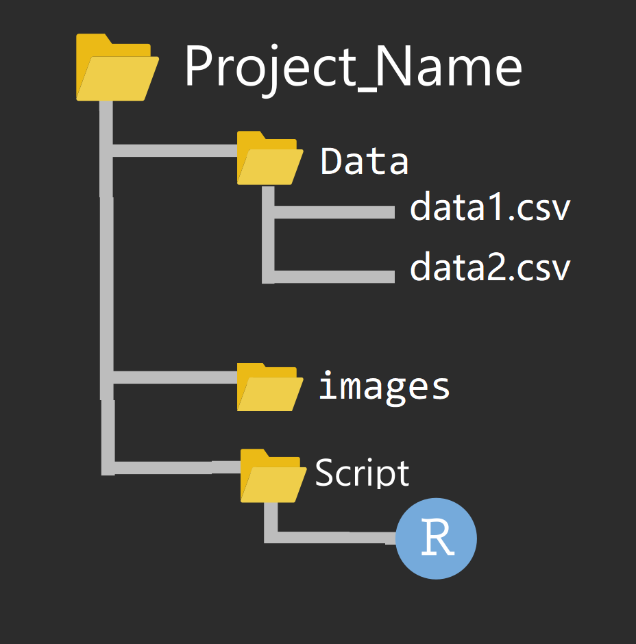

```{r setup, include=FALSE}
options(digits = 3)
knitr::opts_chunk$set(
  comment = "#>",
  echo = TRUE,
  collapse = TRUE,
  message = FALSE,
  warning = FALSE,
  out.width = "100%",
  fig.align = "center",
  fig.asp = 0.618, # 1 / phi
  fig.show = "hold"
)
```


# 项目管理

## 项目管理
- 把项目所需的文件（代码、数据、图片等），放在一个文件夹里

```{r readr-1, out.width='55%', fig.align='center', echo=FALSE}

```

## 文件夹命名

**推荐**我自己的文件夹命名习惯 (项目名+日期)，注意这里不要有**中文和空格**, 比如下面风格的就比较好 

- `homework20201014`
- `project20201014`
- `Emotional_experiment20201014` 


# 数据读取

## 读取数据 

R语言提供了很多读取数据的函数。
\footnotesize

文件格式                       |       **R** 函数 
:---------------------------   |       :----------------------
.txt                           |       `read.table()`
.csv                           |       `read.csv()` and `readr::read_csv()`
.xls and .xlsx                 |       `readxl::read_excel()` and `openxlsx::read.xlsx()`
.sav(SPSS files)               |       `haven::read_sav()` and `foreign::read.spss()`
.Rdata or rda                  |       `load()`
.rds                           |       `readRDS()` and `readr::read_rds()` 
.dta                           |       `haven::read_dta()` and `haven::read_stata()`
.sas7bdat(SAS files)           |       `haven::read_sas()`
Internet                       |       `download.file()`


## 文件路径

在读取文件时，路径的写法有如下方式（以图像文件"a.jpg"为例）

- 如果以当前项目文件为中心，图片在当前目录，它的路径
"./a.jpg"

- 如果以当前项目文件为中心，图片在下一层目录的images文件夹
"./images/a.jpg"

- 如果以当前项目文件为中心，图片在上一层目录下，它的路径
"../a.jpg"

- 如果以当前项目文件为中心，图片在上一层目录的images文件夹，它的路径
"../images/a.jpg"

- 从根目录出发，访问D盘的images文件"b.jpg"图片，它的路径
"D:/images/b.jpg"


## 文件路径

```{r, out.width='55%', fig.align='center', echo=FALSE}

```

## 文件路径

```{r, out.width='55%', fig.align='center', echo=FALSE}

```

```{r, eval=FALSE}
d <- read_csv("./Data/data1.csv")
```

## 文件路径

```{r, out.width='55%', fig.align='center', echo=FALSE}

```


## 文件路径

```{r, out.width='55%', fig.align='center', echo=FALSE}

```

```{r, eval=FALSE}
d <- read_csv("../Data/data1.csv")
```


## 范例 

```{r}
library(readr)
wages <- read_csv("./data/wages.csv")
head(wages, 6)
```


## 范例 
```{r}
library(readxl)
d <- read_excel("../demo_data/olympics.xlsx")
tail(d, 6)
```


## 习题

读取demo_data文件夹下kidiq.RDS文件


变量含义：

| 变量       	| 含义             	|
|------------	|------------------	|
| kid_score  	| 小孩考试分数     	|
| mom_hs     	| 母亲是否完成高中 	|
| mom_iq     	| 母亲IQ值         	|
| mom_age    	| 母亲年龄         	|

请说出数据框中每一列的变量类型

