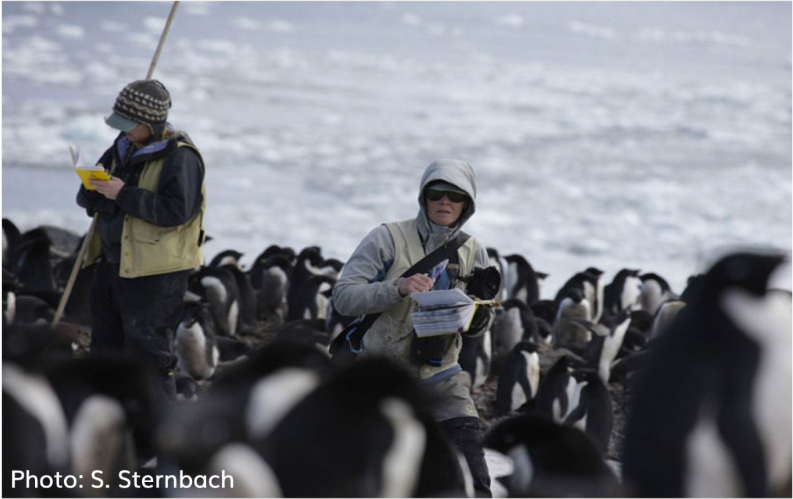

今天讲一个关于企鹅的数据故事。

```{r out.width = '100%', echo = FALSE}

```


# 导入数据

```{r message = FALSE, warning = FALSE}
library(tidyverse)

penguins <- read_csv("./demo_data/penguins.csv") 
penguins
```


## 变量含义

|variable          |class     |description |
|:-----------------|:---------|:-----------|
|species           |character | 企鹅种类 (Adelie, Gentoo, Chinstrap) |
|island            |character | 所在岛屿 (Biscoe, Dream, Torgersen) |
|bill_length_mm    |double    | 嘴峰长度 (单位毫米) |
|bill_depth_mm     |double    | 嘴峰深度 (单位毫米)|
|flipper_length_mm |integer   | 鰭肢长度 (单位毫米) |
|body_mass_g       |integer   | 体重 (单位克) |
|sex               |character | 性别 |
|year              |integer   | 记录年份 |


```{r out.width = '86%', echo = FALSE}
knitr::include_graphics("images/culmen_depth.png")
```


# 探索性分析

探索以下问题：

- 每种类型企鹅有多少只？
- 男企鹅的身材比女企鹅好？
- 男企鹅的嘴巴比女企鹅的长？
- 不同岛屿的企鹅嘴峰深度不同？
- 不同种类的宝宝，体重均值是否不同？
- ...


## 选择"bill_"开始的列

```{r}
penguins %>% select(bill_length_mm, bill_depth_mm)

penguins %>% select(starts_with("bill_"))
```


## 选择"_mm"结尾的列

```{r}
penguins %>% select(bill_length_mm, bill_depth_mm, flipper_length_mm)

penguins %>% select(ends_with("_mm"))
```


## 选择含有"length"的列
```{r}
penguins %>% select(bill_length_mm, flipper_length_mm)

penguins %>% select(contains("length"))
```


## 选择数值型的列

```{r}
penguins %>% select(where(is.numeric))
```


## 选择字符串类型的列

```{r}
penguins %>% select(where(is.character))
```


## 选择字符串类型以外的列

```{r}
penguins %>% select(!where(is.character))
```

## 可以用多种组合来选择

```{r}
penguins %>% select(species, starts_with("bill_"))
```


## 寻找男企鹅

函数 `filter()` 中的逻辑运算符

Operator  | Meaning
----------|--------
`==`      | Equal to
`>`       | Greater than
`<`       | Less than
`>=`      | Greater than or equal to
`<=`      | Less than or equal to
`!=`      | Not equal to
`%in%`    | in 
`is.na`   | is a missing value (NA)
`!is.na`  | is not a missing value
`&`       | and
`|`       | or


```{r}
penguins %>% filter(sex == "male")
```


```{r}
penguins %>% filter(sex == "male")
```


```{r}
penguins %>%
  filter(species == "Adelie" &  bill_length_mm > 40 )


penguins %>%
  filter(species == "Adelie", bill_length_mm > 40 )
```


**课堂练习**，说出以下代码的含义
```{r}
penguins %>%
  filter(species == "Adelie", bill_length_mm == max(bill_length_mm) )
```


`between()`的用法
```{r}
penguins %>% filter(bill_length_mm > 35, bill_length_mm < 40)

penguins %>% filter( between(bill_length_mm, 35, 40) )
```


## 弱水三千，只取一瓢
```{r}
penguins %>% 
  head()

penguins %>% 
  tail()
```


```{r}
penguins %>% 
  slice(1)
```


```{r}
penguins %>% 
  group_by(species) %>% 
  slice(1)
```


## 嘴峰长度最大那一行

三种方法

```{r}
penguins %>%
  filter(bill_length_mm == max(bill_length_mm) )
```


```{r}
penguins %>% 
  arrange(desc(bill_length_mm)) %>% 
  slice(1)
```


```{r}
penguins %>% 
  slice_max(bill_length_mm)
```


## separate
```{r}
tb <- tibble::tribble(
  ~day, ~price,
  1,   "30-45",
  2,   "40-95",
  3,   "89-65",
  4,   "45-63",
  5,   "52-42"
)

```

```{r}
tb1 <- tb %>% 
  separate(price, into = c("low", "high"), sep = "-")
tb1
```

## unite
```{r}
tb1 %>% 
  unite(col = "price", c(low, high), sep = ":", remove = FALSE)
```


## 有关NA的计算

`NA`很讨厌，凡是它参与的四则运算，结果都是`NA`，

```{r}
sum(c(1, 2, NA, 4))
```

所以需要事先把它删除，增加参数说明 `na.rm = TRUE`
```{r}
sum(c(1, 2, NA, 4), na.rm = FALSE)
```

```{r}
mean(c(1, 2, NA, 4), na.rm = FALSE)
```


## 寻找企鹅中的胖子

```{r}
penguins %>% 
  mutate(
    body = if_else(body_mass_g > 4200, "you are fat", "you are fine")
)
```

**随堂练习**：用考试成绩的均值代替缺失值(NA)

```{r}
df <- tibble::tribble(
    ~name,      ~type, ~score,
  "Alice",  "english",    80,
  "Alice",     "math",    NA,
    "Bob",  "english",    70,
    "Bob",     "math",    69,
  "Carol",  "english",    NA,
  "Carol",     "math",    90
  )
df
```


```{r}
df %>% 
  group_by(type) %>% 
  mutate(mean_score = mean(score, na.rm = TRUE)) %>% 
  mutate(newscore = if_else(is.na(score), mean_score, score))
```

## 给企鹅身材分类

```{r}
penguins %>% mutate(
  body = case_when(
    body_mass_g < 3500                       ~ "best",
    body_mass_g >= 3500 & body_mass_g < 4500 ~ "good",
    body_mass_g >= 4500 & body_mass_g < 5500 ~ "general",
    TRUE                                     ~ "other"
  )
)
```


**随堂练习**：按嘴峰长度分成A, B, C, D 4个等级

```{r}
penguins %>% mutate(
  degree = case_when(
    bill_length_mm < 35                        ~ "A",
    bill_length_mm >= 35 & bill_length_mm < 45 ~ "B",
    bill_length_mm >= 45 & bill_length_mm < 55 ~ "C",
    TRUE                                       ~ "D"
  )
)
```


## 每种类型企鹅有多少只？

知识点：`n()`函数，统计当前分组数据框的行数

```{r}
penguins %>%
  summarise(
    n = n()
  ) 
```


```{r}
penguins %>%
  group_by(species) %>%
  summarise(
    n = n()
  )
```


统计某个变量中**各组**出现的次数，可以使用`count()`函数

```{r}
penguins %>% count(species)
```


不同性别的企鹅各有多少
```{r}
penguins %>% count(sex, sort = TRUE)
```


```{r}
penguins %>% count(island, species)
```


可以在`count()`里构建新变量，并利用这个新变量完成统计。
比如，统计嘴巴长度大于40的企鹅个数

- 常规做法
```{r}
penguins %>%
  filter(bill_length_mm > 40) %>% 
  summarise(
    n = n()
  )
```

- `count()`做法
```{r}
penguins %>% count(longer_bill = bill_length_mm > 40)
```

解析思路：`bill_length_mm > 40`比较算符 返回逻辑型向量，向量里面只有TRUR和FALSE两种值，因此上面的代码相当于统计TRUE有多少个，FALSE有多少个？


## 强制转换

矢量中的元素必须是相同的类型，但如果不一样呢，会发生什么？
这个时候R会**强制转换**成相同的类型。这就涉及数据类型的转换层级

- `character` > `numeric` > `logical`
- `double` > `integer`

比如这里会强制转换成字符串类型
```{r}
c("foo", 1, TRUE)
```

这里会强制转换成数值型
```{r}
c(1, TRUE, FALSE)
```

```{r}
c(TRUE, TRUE, FALSE) %>% sum()
```


**随堂练习**：补全下面代码，求嘴峰长度大于40mm的占比？

```{r}
penguins %>% 
  mutate(is_bigger40 = bill_length_mm > 40)
```


```{r}
penguins %>% 
  mutate(is_bigger40 = bill_length_mm > 40) %>% 
  summarise(
    prop = sum(is_bigger40) / n()
  )
```
