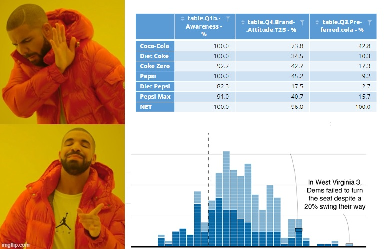
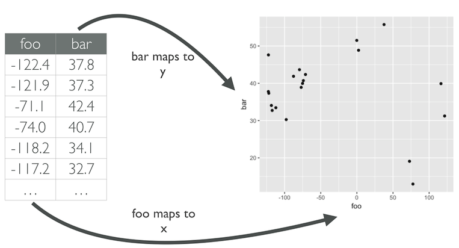
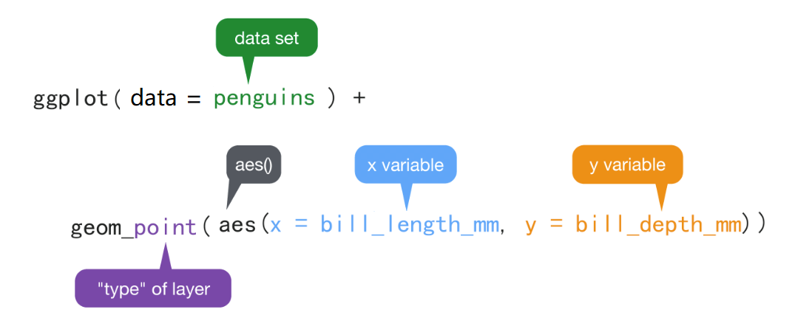

# 什么是数据可视化
 
因为人都是视觉动物。

```{r echo=FALSE, out.width = '100%'}

```


# 图形属性(视觉元素)

一个水杯放在桌子上， 水杯在桌子上的位置、水杯的颜色、水杯的质量是水杯的物理属性。
类似的，我们在图中画一个点，那么这个**点**就有（位置，形状，大小，颜色，透明度）等属性，
这些属性就叫**图形属性**（有时也称之为图形元素或者图形的视觉属性）。


常用的点和线的图形属性

|  geom | x | y | size | color | shape | linetype | alpha | fill | group |
|-------|---|---|------|-------|-------|----------|-------|------|-------|
| point | √ | √ |   √  |   √   |   √   |     √    |   √   |   √  |   √   |
|  line | √ | √ |   √  |   √   |       |     √    |   √   |      |   √   |


## ggplot2 的图形语法

ggplot2有一套优雅的绘图语法，包名中“gg”是grammar of graphics的简称。
Hadley Wickham将这套可视化语法诠释为:


> 一张统计图形就是从**数据**到几何形状(geometric object，缩写geom)所包含的**图形属性**(aesthetic attribute，缩写aes)的一种映射。


即，数值到图形属性的**映射**过程。映射是一个数学词汇，这里您可以理解为**一一对应**。

- `y = f(x)` 数值到数值
- `aes = f(x)` 数值到视觉属性


```{r, out.width = '100%', echo = FALSE}

```


通俗解释：就是我们的**数据**通过图形的**视觉元素**表示出来。比如**点的位置**，
- 如果值越大，水平方向离原点的位置就越远，
- 如果值越小，水平方向离原点的位置就越近。

同理，我们希望用**点的大小**代表这个位置上的某个变量（比如，降雨量，产品销量等等），那么
- 变量的数值越小，点的半径就小一点，数值越大，点就可以大一点；或者
- 变量的数值越大，点的颜色就深一点，数值小，点的颜色就浅一点。

> **数值大小变成了视觉能感知的东西**。


## 怎么写代码

语法模板

```{r, eval = FALSE}
ggplot(data = <DATA>) + 
   <GEOM_FUNCTION>(mapping = aes(<MAPPINGS>))
```


`ggplot()`函数包括9个部件：

- **数据 (data)**      （数据框）
- **映射 (mapping)**
- **几何形状 (geom)**
- 统计变换 (stats)
- 标度 (scale)
- 坐标系 (coord)
- 分面 (facet)
- 主题 (theme)
- 存储和输出 (output)

其中前三个是必需的。


先来点小菜。看一个简单的案例（1880-2014年温度变化和二氧化碳排放量）

```{r, warning = FALSE, message = FALSE}
library(tidyverse)
d <- read_csv("./demo_data/temp_carbon.csv")
d
```


```{r, eval = FALSE}
library(ggplot2)
ggplot(data = ___) + 
  geom_point(
    mapping = aes(x = ___, y = ___)
  )
```


是不是很简单?


# 映射 

继续用科考人员收集的企鹅体征来演示。我们会用到penguins数据集其中的四个变量

```{r, message = FALSE, warning = FALSE}
penguins <- read_csv("./demo_data/penguins.csv") 

penguins %>%
  select(species, sex, bill_length_mm, bill_depth_mm)
```


## 嘴巴越长，嘴巴也会越厚？

回答这个问题，可以先绘制嘴峰长度(bill_length_mm)与嘴峰深度(bill_depth_mm)两个变量的**散点图**


```{r}
ggplot(data = penguins) +
  geom_point(aes(x = bill_length_mm, y = bill_depth_mm))
```


```{r, out.width = '85%', echo = FALSE}

```

- `ggplot()` 初始化绘图，相当于打开了一张纸，准备画画。

- `ggplot(data = penguins)` 表示使用penguins这个**数据框**来画图。

- `+`表示添加图层。

- `geom_point()`表示绘制散点图。

- `aes()`表示数值到视觉属性之间的映射。
  
  `aes(x = bill_length_mm, y = bill_depth_mm)`，意思是
    变量bill_length_mm作为（映射为）**x轴方向的位置**，
    变量bill_depth_mm 作为（映射为）**y轴方向的位置**。

- `aes()`除了位置上映射，还可以实现色彩、形状或透明度等视觉属性的映射


## 不同的企鹅类型，不同的颜色

刚才看到的是位置上的映射，`ggplot()`还可以包含了颜色、形状以及透明度等图形属性的映射，比如我们在`aes()`里增加一个颜色映射` color = species`, 这样做相当于，**不同的企鹅类型**, 用**不同的颜色**来表现。这里，企鹅类型有三组，那么就用三种不同的颜色来表示。


```{r}
ggplot(penguins) +
  geom_point(
    aes(x = bill_length_mm, y = bill_depth_mm, color = species)
  )
```


## 更多映射

大家试试下面代码
```{r}
ggplot(penguins) +
  geom_point(aes(x = bill_length_mm, y = bill_depth_mm, size = species))
```


```{r}
ggplot(penguins) +
  geom_point(aes(x = bill_length_mm, y = bill_depth_mm, shape = species))
```


```{r}
ggplot(penguins) +
  geom_point(aes(x = bill_length_mm, y = bill_depth_mm, alpha = species))
```


```{r}
ggplot(penguins) +
  geom_point(
    aes(x = bill_length_mm, y = bill_depth_mm, color = species, alpha = sex)
  )
```


可以看到，通过`color`, `size`, `shape`, `alpha`等视觉属性可以实现分组的功能。


## 默认的配色方案

为什么图中出现的是这样的颜色呢？因为`ggplot()`内部有一套默认的设置

```{r, out.width = '85%', echo = FALSE}
knitr::include_graphics("images/a-14.png")
```


不喜欢默认的颜色，可以自己定义喔。请往下看


## 映射 vs.设置

想把图中的点指定为某一种颜色，可以使用**设置语句**，比如

```{r}
ggplot(penguins) +
  geom_point(aes(x = bill_length_mm, y = bill_depth_mm), color = "orange")
```


大家也可以试试下面
```{r}
ggplot(penguins) +
  geom_point(aes(x = bill_length_mm, y = bill_depth_mm), size = 5)
```


```{r}
ggplot(penguins) +
  geom_point(aes(x = bill_length_mm, y = bill_depth_mm), shape = 21)
```


```{r}
ggplot(penguins) +
  geom_point(aes(x = bill_length_mm, y = bill_depth_mm), alpha = 0.1)
```


### 提问

思考下两张图为什么不同？

```{r}
ggplot(penguins) +
  geom_point(aes(x = bill_length_mm, y = bill_depth_mm, color = "blue"))
```


```{r}
ggplot(penguins) +
  geom_point(aes(x = bill_length_mm, y = bill_depth_mm), color = "blue")
```


# 几何形状

`geom_point()` 画散点图， `geom_line()` 画折线图，`geom_smooth()`绘制平滑曲线，

```{r}
ggplot(penguins) +
  geom_smooth(aes(x = bill_length_mm, y = bill_depth_mm))
```


```{r}
ggplot(penguins) +
  geom_smooth(
    aes(x = bill_length_mm, y = bill_depth_mm),
    method = "lm"
   )
```


# 图层叠加

```{r}
ggplot(penguins) +
  geom_point(aes(x = bill_length_mm, y = bill_depth_mm)) +
  geom_smooth(aes(x = bill_length_mm, y = bill_depth_mm))
```

> 很强大，但相同的代码让我写两遍，我不高兴。要在偷懒的路上追求简约


```{r}
ggplot(penguins, aes(x = bill_length_mm, y = bill_depth_mm)) +
  geom_point() +
  geom_smooth()
```


> 以上两段代码出来的图是一样。但背后的含义却不同。简约不等于简单。


# Global vs. Local

- 映射关系`aes(x = bill_length_mm, y = bill_depth_mm)` 写在`ggplot()`里,
  为**全局声明**。那么，当`geom_point()`画图时，发现缺少所绘图所需要的映射关系（点的位置、点的大小、点的颜色等等），就会从`ggplot()`全局声明中继承映射关系。

- 如果映射关系`aes(x = bill_length_mm, y = bill_depth_mm)`
  写在几何形状`geom_point()`里, 那么此处的映射关系就为**局部声明**,
  那么`geom_point()`绘图时，发现所需要的映射关系已经存在，就不会继承全局声明的映射关系。


## 图层从全局声明中继承

体会下代码之间的区别

```{r}
ggplot(penguins, aes(x = bill_length_mm, y = bill_depth_mm, color = species)) +
  geom_point()
```


```{r}
ggplot(penguins, aes(x = bill_length_mm, y = bill_depth_mm)) +
  geom_point(aes(color = species))
```


```{r}
ggplot(penguins, aes(x = bill_length_mm, y = bill_depth_mm, color = sex)) +
  geom_point(aes(color = species))
```


## 图层之间没有继承关系

思考图中会有几种颜色？几条曲线？

```{r}
ggplot(penguins, aes(x = bill_length_mm, y = bill_depth_mm)) +
  geom_point() +
  geom_smooth(method = "lm")
```


```{r}
ggplot(penguins, aes(x = bill_length_mm, y = bill_depth_mm)) +
  geom_point(aes(color = species)) +
  geom_smooth(method = "lm")
```


```{r}
ggplot(penguins, aes(x = bill_length_mm, y = bill_depth_mm, color = species)) +
  geom_point() +
  geom_smooth(method = "lm") 
```


```{r}
ggplot(penguins, aes(x = bill_length_mm, y = bill_depth_mm, color = species)) +
  geom_point(aes(color = sex)) +
  geom_smooth(method = "lm") 
```


```{r}
ggplot(penguins, aes(x = bill_length_mm, y = bill_depth_mm, color = species)) +
  geom_point() +
  geom_smooth(method = "lm", aes(color = sex)) 
```


## 使用管道

```{r}
penguins %>% 
  ggplot(aes(x = bill_length_mm, y = bill_depth_mm, color = species)) +
  geom_point() +
  geom_smooth(method = "lm", aes(color = sex)) 
```


## 课堂作业

补充代码，要求在一张图中画出

- 企鹅嘴巴长度和嘴巴厚度的散点图
- 不同企鹅种类用不同的颜色
- 整体的线性拟合
- 不同种类分别线性拟合


```{r eval = FALSE}
ggplot(penguins, aes(x = ___, y = ___)) +
  geom_point() +
  geom_smooth() +
  geom_smooth() 
```


# 保存图片

可以使用`ggsave()`函数，将图片保存为所需要的格式，如".pdf", ".png"等

```{r}
p1 <- penguins %>% 
  ggplot(aes(x = bill_length_mm, y = bill_depth_mm)) +
  geom_smooth(method = lm) +
  geom_point(aes(color = species)) +
  ggtitle("This is my first plot")

ggsave(
  plot = p1,
  filename = "my_plot.pdf",
  width = 8,
  height = 6,
  dpi = 300
)
```


如果想保存当前图形，`ggplot()` 也可以不用赋值，`ggsave()`会自动保存最近一次的绘图
```{r}
penguins %>% 
  ggplot(aes(x = bill_length_mm, y = bill_depth_mm)) +
  geom_smooth(method = lm) +
  geom_point(aes(color = species)) +
  ggtitle("This is my first plot")


ggsave("my_last_plot.pdf", width = 8, height = 6, dpi = 300)
```


# 思考

一个点，有位置、颜色、大小、形状外，还有哪些属性？如果画线条，应该有哪些视觉属性？

  - 打开 <https://ggplot2tor.com/aesthetics>
  - 输入 geom_point 或者 geom_line 试试

