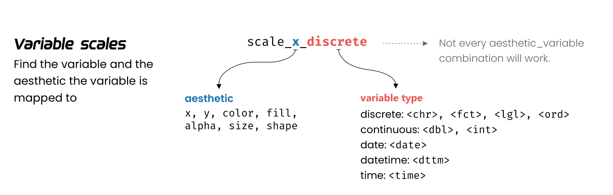

> 各花入各眼，何必问来人


# 标度

```{r, message=FALSE, warning=FALSE}
library(tidyverse)
penguins <- read_csv("./demo_data/penguins.csv") 

penguins %>% 
  ggplot(aes(x = bill_length_mm, y = bill_depth_mm)) +
  geom_point(aes(colour = species))  
```

这个图还是挺漂亮的，那是因为ggplot2默认缺省条件下，已经很美观了。（据说Hadley Wickham很后悔使用了这么漂亮的缺省值，因为很漂亮了大家都不认真学画图了。马云好像也说后悔创立了阿里巴巴？）

但不是每个人都喜欢这种款式，好比不是人人都喜欢肖站一样。好在 ggplot2 能让我们按照自己的想法进行调整。


因此，今天我们学习标度(scale)的概念。
**标度**是用于调整映射关系，具体来说就是调整**数据所映射的图形属性**。
比如，系统默认`"a"`对应红色，`"b"`对应蓝色，我们现在想让`"a"`对应紫色，`"b"`对应橙色。


## 丰富的标度体系

ggplot2中标度函数是由"_"分割的三个部分构成的，
```{r, echo = FALSE}

```

- scale
- 视觉属性名 (e.g., colour, shape or x)
- 标度名 (e.g., continuous, discrete, brewer, manual)


每个标度函数内部都有丰富的参数系统，

- 位置标度
```{r, eval=FALSE}
scale_x_continuous(
  name = waiver(),
  breaks = waiver(),
  minor_breaks = waiver(),
  n.breaks = NULL,
  labels = waiver(),
  limits = NULL,
  expand = waiver(),
  oob = censor,
  na.value = NA_real_,
  trans = "identity",
  guide = waiver(),
  position = "bottom",
  sec.axis = waiver()
)
```

- 颜色标度
```{r, eval=FALSE}
scale_colour_manual(
  palette = function(), 
  limits = NULL,
  name = waiver(),
  labels = waiver(),
  breaks = waiver(),
  minor_breaks = waiver(),
  values = waiver(),
  ...
)
```

- 参数`name`，坐标和图例的名字，如果不想要图例的名字，就可以 `name = NULL`

- 参数`limits`, 坐标或图例的范围区间。连续性`c(n, m)`，离散型`c("a", "b", "c")`

- 参数`breaks`, 控制显示在**坐标轴**或者**图例**上的刻度值（刻度位置）

- 参数`labels`, 坐标和图例的间隔**标签**
  - 一般情况下，内置函数会自动完成
  - 也可人工指定一个字符型向量，与`breaks`提供的字符型向量一一对应
  - 也可以是**函数**，把`breaks`提供的字符型向量当做函数的输入
  - `NULL`，就是去掉标签

- 参数`values` 指的是（颜色、形状等）视觉属性值, 
  - 要么，与数值的顺序一致；
  - 要么，与`breaks`提供的字符型向量长度一致
  - 要么，用命名向量`c("数据标签" = "视觉属性")`提供

- 参数`expand`, 控制参数溢出量


下面，我们通过具体的案例讲解如何使用参数，把图形变成我们想要的模样。


# 位置标度

```{r}
penguins %>% 
  ggplot(aes(x = bill_length_mm, y = bill_depth_mm)) +
  geom_point(aes(color = species)) 
```


## 修改横坐标标题

```{r}
penguins %>% 
  ggplot(aes(x = bill_length_mm, y = bill_depth_mm)) +
  geom_point(aes(colour = species)) +
  scale_x_continuous(
    name = "这是我的横坐标"
  )
```

## 修改坐标轴范围

```{r}
penguins %>% 
  ggplot(aes(x = bill_length_mm, y = bill_depth_mm)) +
  geom_point(aes(colour = species)) +
  scale_x_continuous(
    limits = c(20, 70)
  )
```


## 扩展坐标轴的可视范围

比较下面两张图的区别
```{r}
penguins %>% 
  ggplot(aes(x = species)) +
  geom_bar()


penguins %>% 
  ggplot(aes(x = species)) +
  geom_bar() +
  scale_x_discrete(expand = c(0, 0)) 
```

- 离散的坐标轴，默认有0.6个单位的扩展
- 连续的坐标轴，默认有5%的扩展，可以通过`expand = expansion(mult = , add = )` 重新设置

```{r}
penguins %>% 
  ggplot(aes(x = bill_length_mm, y = bill_depth_mm)) +
  geom_point(aes(colour = species)) +
  scale_x_continuous(
    expand = expansion(mult = 0, add = 0)
  )
```


## 修改横坐标刻度为`c(30, 35, 40, 45, 50, 55, 60)`
这个坐标刻度，类似我们腰带皮带上打孔的意思。

可以很实诚地手动完成
```{r}
penguins %>% 
  ggplot(aes(x = bill_length_mm, y = bill_depth_mm)) +
  geom_point() +
  scale_x_continuous(
    limits = c(30, 60),
    breaks = c(30, 35, 40, 45, 50, 55, 60)
  )
```


也可以偷懒用函数

```{r}
penguins %>% 
  ggplot(aes(x = bill_length_mm, y = bill_depth_mm)) +
  geom_point() +
  scale_x_continuous(
    limits = c(30, 60),
    breaks = seq(from = 30, to = 60, by = 5)
  )
```


```{r}
penguins %>% 
  ggplot(aes(x = bill_length_mm, y = bill_depth_mm)) +
  geom_point() +
  scale_x_continuous(
    limits = c(30, 60),
    breaks = scales::breaks_width(width = 5)
  )
```


```{r}
penguins %>% 
  ggplot(aes(x = bill_length_mm, y = bill_depth_mm)) +
  geom_point() +
  scale_x_continuous(
    limits = c(30, 60),
    breaks = scales::breaks_width(width = 5, offset = 3)
  )
```


也可以自定义刻度位置^[`breaks`的对应函数，其参数是一个长度为2的向量，代表数据的范围]

```{r}
penguins %>% 
  ggplot(aes(x = bill_length_mm, y = bill_depth_mm)) +
  geom_point() +
  scale_x_continuous(
    breaks = function(y) seq(floor(y[1]), ceiling(y[2]), by = 2) 
  )
```


```{r}
penguins %>% 
  ggplot(aes(x = bill_length_mm, y = bill_depth_mm)) +
  geom_point() +
  scale_x_continuous(
    breaks = function(y) seq(floor(min(y)), ceiling(max(y)), by = 2) 
  )
```


```{r}
penguins %>% 
  ggplot(aes(x = bill_length_mm, y = bill_depth_mm)) +
  geom_point() +
  scale_x_continuous(
    limits = c(30, 60),
    breaks = scales::breaks_pretty(12)
  )
```


## 修改横坐标标签

让横坐标标签有单位（在皮带打孔的位置写上含义），比如`30mm, 35mm, 40mm, 45mm, 50mm, 55mm, 60mm`

你可能是一个很实诚的娃
```{r}
penguins %>% 
  ggplot(aes(x = bill_length_mm, y = bill_depth_mm)) +
  geom_point() +
  scale_x_continuous(
    limits = c(30, 60),
    breaks = c(30, 35, 40, 45, 50, 55, 60),
    labels = c("30mm", "35mm", "40mm", "45mm", "50mm", "55mm", "60mm")
  )
```

也可以使用柔软的函数
```{r}
penguins %>% 
  ggplot(aes(x = bill_length_mm, y = bill_depth_mm)) +
  geom_point() +
  scale_x_continuous(
    limits = c(30, 60),
    breaks = seq(from = 30, to = 60, by = 5), 
    labels = function(x) paste0(x, "_mm")
  )
```


```{r}
penguins %>% 
  ggplot(aes(x = bill_length_mm, y = bill_depth_mm)) +
  geom_point(aes(colour = species)) +
  scale_x_continuous(
    name = "这是我的横坐标",
    limits = c(30, 60),
    breaks = scales::breaks_width(width = 5),
    labels = scales::label_number(accuracy = 1, suffix = "mm")
  )
```


```{r}
penguins %>% 
  ggplot(aes(x = bill_length_mm, y = bill_depth_mm)) +
  geom_point(aes(colour = species)) +
  scale_x_continuous(
    limits = c(30, 60),
    labels = scales::unit_format(unit = "mm", sep = "")
  )
```


```{r}
penguins %>% 
  ggplot(aes(x = bill_length_mm, y = bill_depth_mm)) +
  geom_point() +
  scale_x_continuous(
    limits = c(30, 60),
    labels = scales::dollar
  )
```


```{r}
penguins %>% 
  ggplot(aes(x = bill_length_mm, y = bill_depth_mm)) +
  geom_point(aes(colour = species)) +
  scale_x_continuous(
    limits = c(30, 60),
    labels = scales::label_number(accuracy = 1, prefix = "CNY")
  )
```


```{r}
penguins %>% 
  ggplot(aes(x = bill_length_mm, y = bill_depth_mm)) +
  geom_point(aes(colour = species)) +
  scale_x_continuous(
    limits = c(30, 60),
    labels = scales::label_percent()
  ) 
```


```{r}
penguins %>% 
  ggplot(aes(x = bill_length_mm, y = bill_depth_mm)) +
  geom_point(aes(colour = species)) +
  scale_x_continuous(
    labels = NULL        # vs NA
  )
```


**课堂练习**：让纵坐标的标签有单位，比如`12mm, 14mm, 16mm, 18mm, 20mm, 22mm`

```{r, eval=FALSE}
penguins %>% 
  ggplot(aes(x = bill_length_mm, y = bill_depth_mm)) +
  geom_point() +
  scale_y_continuous(
    
  )
```


## 坐标轴转换

$x$ -> $x^{-1}$

```{r}
penguins %>% 
  ggplot(aes(x = bill_length_mm, y = bill_depth_mm)) +
  geom_point() +
  scale_x_continuous(trans = "reciprocal")
```


$x$ -> $\log_{10}(x)$

```{r}
penguins %>% 
  ggplot(aes(x = bill_length_mm, y = bill_depth_mm)) +
  geom_point() +
  scale_x_continuous(
    trans = "log10"
  ) 
```


ggplot2也提供了更方便的函数

- 坐标轴取对数 $x$ -> $\log_{10}(x)$

```{r}
penguins %>% 
  ggplot(aes(x = bill_length_mm, y = bill_depth_mm)) +
  geom_point() +
  scale_x_log10()
```


- 坐标轴取开方 $x$ -> $x^{1/2}$
```{r}
penguins %>% 
  ggplot(aes(x = bill_length_mm, y = bill_depth_mm)) +
  geom_point() +
  scale_x_sqrt()
```

- 让坐标轴反向$x$ -> $-x$
```{r}
penguins %>% 
  ggplot(aes(x = bill_length_mm, y = bill_depth_mm)) +
  geom_point() +
  scale_x_reverse()
```


```{r}
penguins %>% 
  ggplot(aes(x = bill_length_mm, y = bill_depth_mm)) +
  geom_point(aes(colour = species)) +
  scale_x_reverse(position = "top")
```


**课堂练习**：能否让y轴也反向且居右？


# 颜色标度

```{r}
penguins %>% 
  ggplot(aes(x = bill_length_mm, y = bill_depth_mm)) +
  geom_point(aes(color =  species)) 
```


## 使用自己喜欢的颜色

问题来了，颜色怎么对应各种企鹅呢？


我们指定三种颜色，默认按照 "Adelie", "Chinstrap", "Gentoo" 字母的顺序一一对应
(类似幼儿园的三个小朋友"Adelie", "Chinstrap", "Gentoo"，按照名字排排坐好了，我们按照座次发果果)
```{r}
penguins %>% 
  ggplot(aes(x = bill_length_mm, y = bill_depth_mm)) +
  geom_point(aes(colour = species)) +
  scale_color_manual(
    values = c("darkorange", "purple", "cyan4") 
  )
```


也可以让小朋友和颜色一一对应

```{r}
penguins %>%
  ggplot(aes(x = bill_length_mm, y = bill_depth_mm)) +
  geom_point(aes(colour = species)) +
  scale_color_manual(
    values = c(
      "Chinstrap" = "darkorange",
      "Gentoo"    = "purple",
      "Adelie"    = "cyan4"
    )
  )
```


也可以先 `breaks` 然后 `values`
```{r}
penguins %>% 
  ggplot(aes(x = bill_length_mm, y = bill_depth_mm)) +
  geom_point(aes(colour = species)) +
  scale_color_manual(
     breaks = c("Adelie", "Gentoo", "Chinstrap"), 
     values = c("darkorange", "purple", "cyan4")
  )
```

最好是这样，一一对应，清晰明了


**课堂练习**，自己定义颜色吧
```{r, eval=FALSE}
penguins %>% 
  ggplot(aes(x = bill_length_mm, y = bill_depth_mm)) +
  geom_point(aes(colour = species)) +
  scale_color_manual(
    values = c("Adelie" = "___",  "Chinstrap" = "___", "Gentoo" = "___")
  )
```


## 使用自己喜欢的填充色

方法和上面一样

```{r}
penguins %>% 
   ggplot(aes(bill_length_mm, fill = species)) +
   geom_density(alpha = 0.6) +
   scale_fill_manual(
     breaks = c("Adelie", "Chinstrap", "Gentoo"), 
     values = c("darkorange", "purple", "cyan4")
  )
```


**课堂练习**：下面的柱状图，希望不同的柱子使用不同的颜色
```{r}
penguins %>% 
  group_by(species) %>% 
  summarise(
    mean = mean(bill_length_mm)
  ) %>% 
  ggplot(aes(x = species, y = mean)) +
  geom_col(width = 0.5)
```


**课堂练习**：完成上一节课的问题，用单独一个颜色高亮Gentoo那根柱子，其他两个柱子用灰色

- 方案1
```{r}
penguins %>% 
  group_by(species) %>% 
  summarise(
    mean = mean(bill_length_mm)
  ) %>% 
  ggplot(aes(x = species, y = mean, fill = species)) +
  geom_col(width = 0.5) +
  scale_fill_manual(
    values = c("gray", "gray", "red")
  )
```

- 方案2 
```{r}
penguins %>% 
  count(species) %>% 
  mutate(is_Gentoo = if_else(species == "Gentoo", "yes", "no")) %>% 
  
  ggplot(aes(x = fct_reorder(species, n), y = n, fill = is_Gentoo)) +
  geom_col(width = 0.5) +
  scale_fill_manual(
     values = c("gray60", "darkorange")
  ) +
  theme_classic() +
  theme(legend.position = "none")
```


## 使用模板配色

- 可以使用[ColorBrewer](https://colorbrewer2.org)色彩

```{r}
penguins %>% 
  ggplot(aes(x = bill_length_mm, y = bill_depth_mm)) +
  geom_point(aes(colour = species)) +
  scale_color_brewer(type = "qual", palette = "Set1")
```


```{r, fig.width = 5, fig.asp = 0.618}
penguins %>% 
  group_by(species) %>% 
  summarise(
    mean = mean(bill_length_mm)
  ) %>% 
  ggplot(aes(x = species, y = mean)) +
  geom_col(aes(fill = species)) + 
  scale_fill_brewer(palette = "Set2", guide = NULL)
```


- 我比较喜欢使用[colorspace](http://colorspace.r-forge.r-project.org/articles/colorspace.html)模板的配色

```{r}
colorspace::qualitative_hcl(n = 3, palette = "cold") %>% 
  colorspace::swatchplot()
```


```{r}
library(colorspace)
penguins %>% 
  ggplot(aes(bill_length_mm, fill = species)) +
  geom_density(alpha = 0.6) +
  scale_fill_discrete_qualitative(palette = "cold")
```


## 连续的颜色

```{r}
penguins %>% 
  ggplot(aes(x = bill_length_mm, y = bill_depth_mm)) +
  geom_point(aes(color = body_mass_g))
```


```{r}
penguins %>% 
  ggplot(aes(x = bill_length_mm, y = bill_depth_mm)) +
  geom_point(aes(color = body_mass_g)) +
  scale_color_gradient(low = "grey", high = "brown")
```


```{r}
penguins %>% 
  ggplot(aes(x = bill_length_mm, y = bill_depth_mm)) +
  geom_point(aes(fill = body_mass_g), shape = 21) +
  scale_fill_distiller(palette = "Oranges",  direction = 1)
```


```{r}
penguins %>% 
  ggplot(aes(x = bill_length_mm, y = bill_depth_mm)) +
  geom_point(aes(fill = body_mass_g), shape = 21) +
  scale_fill_distiller(palette = "YlGn", direction = 1) 
```


```{r}
penguins %>% 
  ggplot(aes(x = bill_length_mm, y = bill_depth_mm)) +
  geom_point(aes(color = body_mass_g)) +
  scale_color_continuous_sequential(palette = "Red-Yellow")
```


# 其它标度

## 控制图中点的大小变化范围

```{r}
penguins %>% 
  ggplot(aes(x = bill_length_mm, y = bill_depth_mm)) +
  geom_point(aes(size = body_mass_g)) +
  scale_size(
     name = "企鹅体重",
     range = c(1, 10),
     breaks = c(3000, 4000, 5000, 6000),
     labels = c("3kg", "4kg", "5kg", "6kg")
   )
```

这里`range = c(1, 10)`的意思，让体重值最小的点，半径为1；让体重值最大的点，半径为10.


## 更多

- <https://ggplot2.tidyverse.org/>
- <https://ggplot2tor.com/scales>
