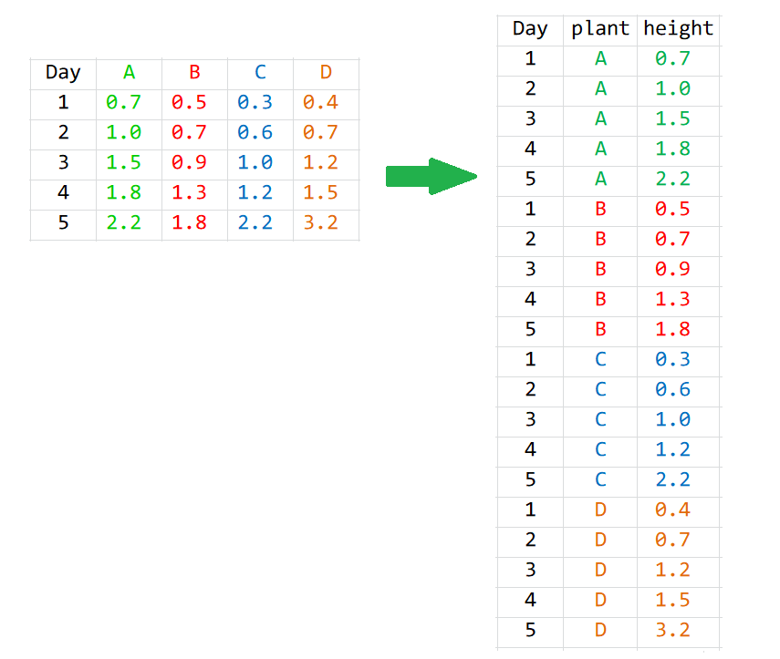

# 提问

假定这里有 `A`, `B`, `C` 和 `D` 四种植物每天生长的记录，

```{r}
library(tidyverse)
plant_height <- data.frame(
  Day = 1:5,
  A = c(0.7, 1.0, 1.5, 1.8, 2.2),
  B = c(0.5, 0.7, 0.9, 1.3, 1.8),
  C = c(0.3, 0.6, 1.0, 1.2, 2.2),
  D = c(0.4, 0.7, 1.2, 1.5, 3.2)
)


plant_height
```


```{block}
大家想想，

- 把植物高度大于或等于0.8cm的时刻**筛选**出来，怎么写语句?
- 用不同的颜色画出四种植物**生长曲线**，怎么写语句?
```

我们首先想到的是用dplyr数据处理和ggplot2可视化，可以写成这样
```{r, eval = FALSE}
plant_height %>% 
  filter( ___ >= 0.8)
```


```{r tidyr-5, eval = FALSE}
plant_height %>% 
  ggplot(aes(x = Day, y = ___, color = ___)) +
  geom_line()
```

然而，发现遇到了问题？数据的格式与我们期望的不一样！


怎么解决呢？想用上面的语句，数据就得变形。那么怎么变形呢？ 


```{r, out.width = '100%', fig.align='left', echo = FALSE}

```

请观察，数据前后发生了什么变化？


- 原来数据框的列名去哪里呢？
- 原来存放植物高度的数值去哪里呢？
- 数据框的大小发生了什么变化？
- 新数据框的列名怎么来的？


# 数据规整

## 宽表格变成长表格

使用`pivot_longer()`函数

```{r}
long <- plant_height %>%
  pivot_longer(
    cols      = A:D,
    names_to  = "plant",
    values_to = "height"
  )
long
```


这里`pivot_longer()`函数有三个主要的参数：

- 参数`cols`，表示**哪些列**需要转换
- 参数`names_to`，表示`cols`选取的这些列的**名字**，构成了新的一列，需要取一个新的列名.
- 参数`values_to`， 表示`cols`选取的这些列的**值**，构成了新的一列，这里也需要取一个新的列名.


当然，参数 `cols` 的写法可以多种形式的：`select()` 怎么用，这里就怎么用。
```{r, eval=FALSE}
plant_height %>% 
  pivot_longer(
    cols = -Day,     # A:D 或者 c(A, B, C, D) 或者 c("A", "B", "C", "D"), 或者-1, 或者2:5
    names_to = "plant",
    values_to = "height"
)

```


- 筛选的问题解决了
```{r}
long %>% 
  filter(height >= 0.8)
```


- 画图的问题也就解决了

```{r}
long %>% 
  ggplot(aes(x = Day, y = height, color = plant)) +
  geom_line()
```


## 记住它

```{r, out.width = '100%', fig.align='left', echo = FALSE}

```


## 长表格变成宽表格

如果，长表格变回宽表格呢？需要用到`pivot_wider()`

```{r}
wide <- long %>% 
  pivot_wider(
    names_from  = "plant",
    values_from = "height"
 )
wide
```


# 案例

下面是企鹅宝宝嘴峰长度的密度分布

```{r, message=FALSE, warning=FALSE}
library(tidyverse)

penguins <- read_csv("./demo_data/penguins.csv") 

penguins
```

- 画出企鹅**各体征变量**的密度分布

```{r, message=FALSE, warning=FALSE}
penguins %>% 
  ggplot(aes(x = bill_length_mm)) +
  geom_density()
```


```{r, message=FALSE, warning=FALSE}
penguins %>% 
  ggplot(aes(x = bill_depth_mm)) +
  geom_density()
```


```{r, message=FALSE, warning=FALSE}
penguins %>% 
  ggplot(aes(x = body_mass_g)) +
  geom_density()
```


```{r, message=FALSE, warning=FALSE}
penguins %>% 
  ggplot(aes(x = flipper_length_mm)) +
  geom_density() 
```


以上的写法，比较累。体会**变成长表格的好处**


```{r}
penguins %>% 
  select(species, bill_length_mm, bill_depth_mm, flipper_length_mm, body_mass_g) %>% 
  pivot_longer(
    cols = -species,
    names_to = "index",
    values_to = "value"
  ) %>% 
  
  ggplot(aes(x = value, color = index)) +
  geom_density() +
  facet_wrap(vars(index), scales = "free")
  
```


每个体征指标下，再以不同的物种分组
```{r}
penguins %>%
  select(species, bill_length_mm:body_mass_g) %>%
  pivot_longer(
    cols      = -species,
    names_to  = "index",
    values_to = "value"
  ) %>%
  ggplot(aes(x = value)) +
  geom_density(aes(color = species, fill = species), size = 1.2, alpha = 0.2) +
  facet_wrap(vars(index), ncol = 2, scales = "free")
```


可以调整为山峦图，也方便


```{r}
penguins %>%
  select(species, bill_length_mm:body_mass_g) %>%
  pivot_longer(
    cols      = -species,
    names_to  = "index",
    values_to = "value"
  ) %>%
  ggplot(aes(x = value, y = species, fill = species)) +
  ggridges::geom_density_ridges() +
  facet_wrap(vars(index), scales = "free")
```


# 课堂练习

- 以体征指标分面，画出不同性别的箱线图

```{r, fig.width= 16, fig.height= 4}
penguins %>%
  select(sex, bill_length_mm:body_mass_g) %>%
  pivot_longer(
    cols      = -sex,
    names_to  = "index",
    values_to = "value"
  ) %>%
  
  ggplot(aes(x = sex, y = value, color = sex)) +
  geom_boxplot() +
  geom_jitter() +
  facet_wrap(vars(index), ncol = 4, scales = "free")
```


- 统计penguins各个体征的均值，然后变成长表格

```{r}
penguins %>%
  select(bill_length_mm:body_mass_g) %>%
  summarise(
    across(everything(), mean)
  ) %>% 
  pivot_longer(
    cols = everything(),
    names_to = "index",
    values_to = "value"
  ) 
```


- 统计penguins各个体征的均值和标准差，然后旋转数据框，让数据框的第一列是函数名

第一种方法

```{r}
df_stat1 <- penguins %>%
  select(bill_length_mm:body_mass_g) %>%
  pivot_longer(
    cols = everything(),
    names_to = "index",
    values_to = "value"
  ) %>%
  group_by(index) %>%
  summarise(
    mean = mean(value),
    sd = sd(value)
  )
df_stat1
```


**提示**：先将mean和sd两列聚合成一列，然后再把**体征指标所在列**弄成列名
```{r}
df_stat1 %>%
  pivot_longer(
    cols = -index,
    names_to = "funss",
    values_to = "value"
  ) %>%
  pivot_wider(
    names_from = index,
    values_from = value
  )
```


第二种方法
```{r}
df_stat2 <- penguins %>%
  select(bill_length_mm:body_mass_g) %>%
  summarise(
    across(everything(),list(mean = mean, sd = sd))
  ) 
df_stat2
```

**提示**：`df_stat2`的列名分成两部分，一部分成为新的一列的值，一部分仍然保持为列名

```{r}
df_stat2 %>% 
  pivot_longer(
    cols = everything(),
    names_to = c(".value", "index"),
    names_pattern = "(.*)_(.*)"
  )
```
