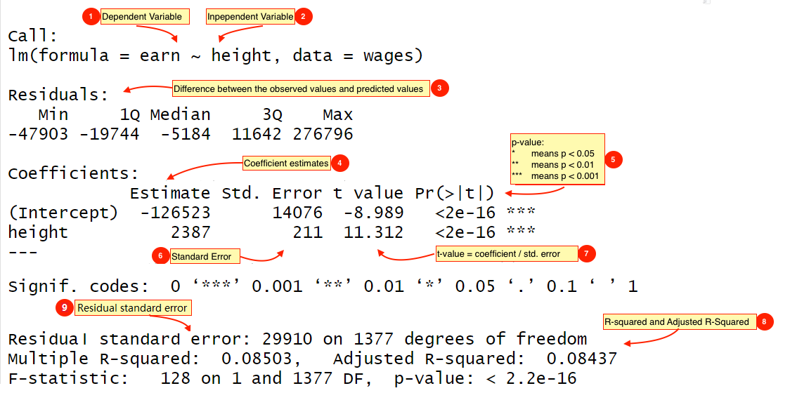

线性模型是数据分析中最常用的一种分析方法。最基础的往往最深刻。

- Everything is regression (t tests, ANOVA, correlation, chi-square, non-parametric)
- The simplest linear regression model


## 从一个案例开始

这是一份1994年收集1379个对象关于收入、身高、教育水平等信息的数据集。首先，我们导入数据
```{r, message = FALSE, warning = FALSE}
library(tidyverse)
wages <- read_csv("./demo_data/wages.csv")

wages %>%
  head()
```


## 数据预处理

### 变量含义

通常，拿到一份数据，首先要了解数据每个变量的含义，

```{r}
wages %>% glimpse()
```

- `earn`    收入
- `height`  身高
- `sex`     性别
- `edu`     受教育程度
- `age`     年龄


### 缺失值检查

然后，检查数据是否有缺失值，这点很重要。

```{r}
# 如何检查数据是否有缺失值？
wages %>%
  summarise(
    earn_na   = sum(is.na(earn)),
    height_na = sum(is.na(height)),
    sex_na    = sum(is.na(sex)),
    race_na   = sum(is.na(race)),
    edu_na    = sum(is.na(edu)),
    age_na    = sum(is.na(age))
  )
```


写代码的人都是偷懒的，希望写的简便一点，Tidyverse函数总是很贴心、很周到。

```{r}
wages %>%
  summarise(
    across(everything(), ~ sum(is.na(.x)))
  ) %>% 
  pivot_longer(
    cols = everything()
  )
```


###  初步统计

然后，探索下每个变量的分布。比如调研数据中男女的数量分别是多少？
```{r}
wages %>% count(sex)
```

```{r}
wages %>% count(race)
```


男女这两组的身高均值分别是多少？收入的均值分别是多少？
```{r}
wages %>%
  group_by(sex) %>%
  summarise(
    n = n(),
    across(c(height, earn), mean)
  )
```

也可以用可视化的方法，呈现男女收入的分布情况
```{r}
wages %>%
  ggplot(aes(x = earn, fill = sex)) + 
  geom_histogram(alpha = 0.5) + 
  labs(x = "earn", y = "Frequency" ) 
```

**课堂练习**  用分面的方法，呈现男女收入的分布情况


大家可以自行探索其他变量的情况。


## 问题

现在提出几个问题，希望大家带着这些问题去思考：

- **长的越高的人挣钱越多？**

- 是否男性比女性挣的多？

- 受教育程度越高，挣钱越多？

- 如果知道年龄、性别和受教育程度，我们能预测他的收入情况吗？预测在多大范围是可信的？


从统计学的角度回答以上问题，需要引入统计模型。


## 长的越高的人挣钱越多？

回答这个问题，可以先可视化收入和身高的关系
```{r}
wages %>%
  ggplot(aes(x = height, y = earn)) +
  geom_point() +
  geom_smooth(method = "lm")
```


图形给出的趋势，非常值得我们通过建立模型加以验证。


假定$y_{i}$是每个样本$i$的收入，$x_{i}$是每个样本$i$的身高，如果将**收入**视为**身高**的线性函数，可以表示为

$$
\begin{aligned}
y_{i} &= \alpha + \beta x_{i} + \epsilon_{i} \\
\epsilon_{i} &\in \text{Normal}(0, \sigma^2) 
\end{aligned}
$$
先解释一些概念：

- 观测数据$y_i$ 分成两个部分，即`data = model + error`
   1. $\alpha + \beta x_{i}$ 就是model
   2. $\epsilon_{i}$ 就是error


- 模型，系数与预测变量的线性组合，给出期望值
$$
\hat{y}_{i}=\alpha + \beta x_{i}
$$

我们的任务是估计**系数**
   - $\alpha$ 代表截距
   - $\beta$ 代表斜率


- 残差 (误差项)，$\epsilon_i$，代表着**真实收入**与模型给出的**期望收入**之间的**偏差**，它与$x$ 无关，服从正态分布。


::: {.rmdnote}

模型中的参数($\alpha$, $\beta$, 和 $\sigma^2$) 通过最小二乘法计算得出：

> 使得残差的平方和最小

```{r out.width = '85%', echo = FALSE}
knitr::include_graphics("images/best_fit.png")
```

::: 


当然，数据量很大，手算是不现实的，我们借助R语言代码吧


### 使用`lm()` 函数

用R语言代码`lm(y ~ x, data)` 是最常用的线性模型函数，`lm()`是linear model的缩写

`lm`参数很多, 但很多我们都用不上，所以我们只关注其中重要的两个参数

```{r, eval = FALSE}
lm(formula = y ~ x, data = __)
```


参数解释说明：

::: {.rmdnote}

* formula：指定回归模型的公式，对于简单的线性回归模型`y ~ x`. 
* ~ 符号：代表“预测”，可以读做“y由x预测”。有些学科不同的表述，比如下面都是可以的
  - `response ~ explanatory`  
  - `dependent ~ independent` 
  - `outcome ~ predictors`
* data：代表数据框，数据框包含了响应变量和独立变量

:::


等不及了，马上运行代码吧
```{r}
mod1 <- lm(
  formula = earn ~ 1 + height,
  data = wages
)
```


注意，以下两者是等价的
```{r, eval=FALSE}
lm(formula = earn ~     height,  data = wages)
lm(formula = earn ~ 1 + height,  data = wages)
```


`lm()`返回赋值给`mod1`， `mod1`是一个叫`lm object`或者叫`类`的东西，我们打印看看，

```{r}
print(mod1)
```

它告诉我们，建立的线性回归模型是

$$
\operatorname{\widehat{earn}} = -126532 + 2387 \; \text{height } 
$$

-126532 乘以1，加上 2387 乘以height

### 模型输出

- 查看详细信息
```{r}
summary(mod1)
```

```{r, echo=FALSE, out.width = '100%'}

```


- 残差
```{r}
resid(mod1) %>% 
  quantile()
```


- 系数
```{r}
coef(mod1)
```

- 系数的置信区间
```{r}
confint(mod1, level = 0.95)
```

- 标准误(Std. Error)。标准误反映的是系数估计的不确定程度。标准误越大，系数估计的不确定越大。
```{r, out.width = '80%', fig.align='center', echo = FALSE}
knitr::include_graphics(path = "images/jhudsl/standard_error.png")
```

- `t value`： 
   t value = 系数/标准误


- $R^2$，拟合优度（Goodness of Fit）是指回归直线对观测值的拟合程度。
```{r}
summary(mod1)$r.squared
summary(mod1)$adj.r.squared
```


- 残差标准误(Residual standard error)

$$
\hat{\sigma}^2 = \sum \hat{\epsilon}^2_{i} / (n-2)
$$ 

```{r}
summary(mod1)$sigma
```


### 模型的解释

**建立一个`lm`模型是简单的，然而最重要的是，我们能解释这个模型。**


$$
\operatorname{\widehat{earn}} = -126523 + 2387(\operatorname{height})
$$


- 对于斜率$\beta = 2387$意味着，当一个人的身高是68英寸时，他的预期收入$earn = -126532 + 2387 \times 68= 35793$ 美元，如果是69英寸时，他的预期收入$earn = -126532 + 2387 \times 69= 38180$ 美元，换个方式说，身高$height$每增加一个1英寸, 收入$earn$会增加2387美元。

- 对于截距$\alpha = -126532$，即当身高为0时，期望的收入值-126532。呵呵，人的身高不可能为0，所以这是一种极端的理论情况，现实不可能发生。


- $R^2$ = 0.08503意味着**该模型**只能解释8%的**收入随身高变化的特征**

```{r}
wages %>%
  ggplot(aes(x = height, y = earn)) +
  geom_point(alpha = 0.25) +
  geom_smooth(method = "lm", se = FALSE)
```


