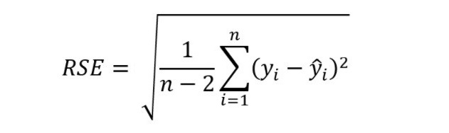

## tidyverse框架下的建模


```{r message = FALSE, warning = FALSE}
library(tidyverse)
wages <- read_csv("./demo_data/wages.csv")

glimpse(wages)
```


```{r}
mod1 <- lm(
  formula = earn ~ 1 + height,
  data = wages
)
```


### 规整统计结果

模型的输出结果是一个复杂的`list`

```{r}
mod1 %>% summary()
```


```{r}
summary(mod1)$residuals
```


broom宏包可以帮助我们**规整**模型输出结果。它将常用的100多种模型的输出结果规整成数据框`tibble()`的格式，在模型比较和可视化中就可以方便使用`dplyr`函数了。

`broom` 提供了三个主要的函数:

- `tidy()` 提取模型输出结果的主要信息，比如 `coefficients` 和 `t-statistics`
- `glance()` 把模型视为一个整体，提取如 `F-statistic`，`model deviance` 或者 `r-squared`等信息
- `augment()` 模型输出的信息添加到建模用的数据集中，比如`fitted values` 和 `residuals` 


```{r}
library(broom)

mod1 %>% 
  tidy() 
```


```{r}
mod1 %>% glance()
```


```{r}
mod1 %>%
  glance() %>%
  select(adj.r.squared, p.value)
```


```{r}
mod1 %>% 
  augment()
```

**课堂练习** 用这个数据框画出散点图，横坐标是height， 纵坐标是.fitted


为什么红色不在了？
```{r}
mod1 %>% 
  broom::augment() %>%
  ggplot(aes(x = height, y = earn)) +
  geom_point() +
  geom_line(aes(y = .fitted), color = "red") +
  geom_smooth(method = "lm")
```


### 拟合和预测

模型方程一旦建立好了
$$
\operatorname{\widehat{earn}} = -126523.359 + 2387.196 \; \text{height } 
$$

给定一个height值，就可以得到相应的earn. 如果带入的 height 是原来建模时候的height 值 就叫拟合，如果带入的是新的height值，就叫预测。很显然，拟合也是一种预测。比如
```{r}
coef(mod1)
```

- 拟合
```{r}
-126523.359 + 2387.196 * wages$height
```

- 预测
```{r}
new_height <- seq(65, 70, by = 1)
-126523.359 + 2387.196 * new_height
```

很显然，对于一元回归模型，每个x值对应一个拟合值，拟合值都在一条直线上，即拟合直线。


我们也可以用`fitted()`函数得到拟合值。
```{r}
fitted(mod1)
```


可以是用`predict()`函数得到预测值。
```{r}
new <- tibble(height = seq(65, 70, by = 1))
predict(mod1, newdata = new)
```

### 增加拟合值

为了让建模操作更方便，让我们的思维限定在`data.frame`，方便使用`dplyr`，`ggplot2`中的函数。我推荐大家使用`modelr`宏包

```{r}
library(modelr)
```


```{r}
# predictions at original x values
wages %>% modelr::add_predictions(mod1)
```


```{r}
wages %>% 
  modelr::add_predictions(mod1) %>% 
  
  ggplot(aes(x = height, y = earn)) +
  geom_point() +
  geom_line(aes(y = pred), color = "red") 
```


### 增加预测值

```{r}
newdata <- data.frame(height = seq(65, 70, by = 1))

newdata %>% 
  modelr::add_predictions(mod1)
```

数据框进、数据框出，非常方便。


::: {.rmdnote}

fit vs predict

- **拟合**, 模型一旦建立，建模和拟合使用的是同一数据

- **预测**，模型建立后，可以用新的数据进行预测

::: 


### 增加残差值
```{r}
wages %>% 
  modelr::add_predictions(mod1) %>%
  modelr::add_residuals(mod1)
```


**课堂练习** 根据模型**残差标准误**公式

```{r, echo=FALSE, out.width = '100%'}

```

使用`modelr::add_residuals(mod1)`计算残差标准误，还原`summary(mod1)$sigma`的结果，对模型理解就更深刻：

```{r, eval=FALSE}
wages %>%
  modelr::add_residuals(mod1) %>% 
  summarise(
    
  )
```


**课堂练习**，上一章模型`mod7`中男女两条拟合直线是截距相同、斜率不同，但是看不出相交，你能用可视化的方法验证？

```{r}
wages_gender <- wages %>% 
  mutate(gender = if_else(sex == "male", 1, 0))

mod7 <- lm(earn ~ 1 + height + height:gender, data = wages_gender)

# 首先，模型 mod7 是height,gender两个预测变量。
# 因此在模型预测的时候，提供的新数据也应该包含 height,gender
# 其次，为了看到y轴截距，height的值应该覆盖到0，所以`height = seq(0, 70, by = 1)`
# 最后，还要考虑性别分组


newdata <- 
  data.frame(height = seq(0, 70, by = 1)) %>% 
  tidyr::crossing(gender = c(0, 1))

newdata %>% 
  modelr::add_predictions(mod7) %>% 
  
  ggplot(aes(x = height, y = pred, group = gender, color = as.factor(gender))) +
  geom_point() +
  geom_line() 
```


### 分组建模

按照性别分组，建立各自的线性回归模型，

```{r}
wages_female <- wages %>%
  filter(sex == "female")

fit_female <- lm(earn ~ 1 + height, data = wages_female)
fit_female
```


```{r}
wages_male <- wages %>%
  filter(sex == "male")

fit_male <- lm(earn ~ 1 + height, data = wages_male)
fit_male
```


有没有方法快速地求出两条直线的截距和斜率？

```{r}
wages %>%
  group_by(sex) %>%
  group_modify(
    ~ broom::tidy(lm(earn ~ 1 + height, data = .))
  )
```


```{r}
wages %>%
  nest_by(sex) %>%
  mutate(model = list(lm(earn ~ 1 + height, data = data))) %>%
  mutate(
    coef = list(broom::tidy(model))
  ) %>% 
  unnest(coef)
```


或者
```{r}
wages %>%
  nest_by(sex) %>%
  mutate(model = list(lm(earn ~ 1 + height, data = data))) %>%
  summarise(
    broom::tidy(model)
  ) 
```


**课后练习**：看文档学函数
- `?dplyr::modify()`
- `?dplyr::nest_by()`


